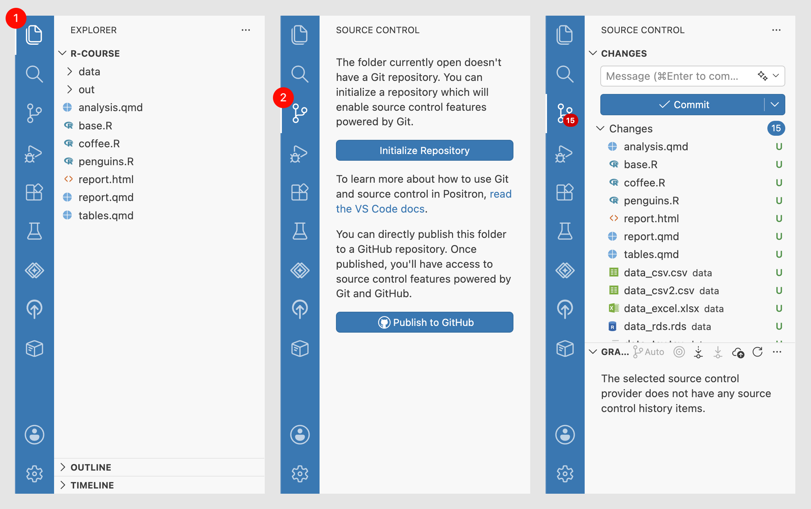

# (PART) Основы {-}

# Создание репозитория {#git-init}

Git может отслеживать изменения в любой папке на вашем компьютере.
Для этого нужно инициализировать в ней Git репозиторий.
**Репозиторий** --- это скрытая подпапка `.git`, в которой хранятся версии проекта и информация об изменениях.
Всё необходимое для работы Git содержится непосредственно в ней.

Мы продолжим проект из курса «Введение в автоматизацию обработки данных на R». Откройте его в Positron по [инструкции из курса](https://stepik.org/lesson/2482459/step/5?unit=2520221): нажмите [Open]{.figtext} на верхней панели, выберите Open Folder… и найдите нужную папку.

Если проекта нет, создайте его, как показано [в курсе](https://stepik.org/lesson/2482459/step/2?unit=2520221). Затем создайте папку `data`, скачайте файл [`penguins.csv`](https://stepik.org/media/attachments/lesson/2482459/penguins.csv) и поместите его туда.

Убедитесь, что папка открыта: в панели [(1) Explorer]{.figtext} должны быть видны файлы, в том числе папка `data`.
Откройте пункт [(2) Source Control]{.figtext} на панели слева и нажмите [Initialize Repository]{.figtext}.
Positron создаст репозиторий в папке проекта. На панели в разделе [Changes]{.figtext} появится список файлов.

{width=100%}

Когда в Positron открыт проект, R и Git ищут файлы в ней --- это так называемая **рабочая папка или рабочая область**.

<details><summary>Подробнее про поиск и адреса файлов.</summary>
На разных компьютерах, например у разных участников, проект может находиться в разных местах.
У пользователя с именем `mjordan` это может быть `/Users/mjordan/penguins`,
а у пользователя `scruz` допустим  
`C:\Users\scruz\penguins`.

Если в документе использовать полный адрес файла, например:

```r
read.csv("/Users/mjordan/r-course/data/penguins.csv")
```

то он будет работать только у пользователя `mjordan`.
У других полный адрес будет отличаться, и код «сломается».
Чтобы он работал у всех, нужно указывать адрес файла относительно рабочей папки.

```r
read.csv("data/penguins.csv")
```
</details>

Внутри папки проекта создана папка репозитория `.git`. Открывать или изменять её содержимое не нужно, поэтому она скрыта. Для работы с репозиторием используют панель [Source Control]{.figtext} и команды в терминале.

<details><summary>Как увидеть скрытую папку.</summary>
Positron не показывает некоторые служебные папки на панели Explorer.
Чтобы увидеть их, откройте терминал и выполните команду:

```shell
ls -la
```

В Windows может потребоваться другая команда:

```powershell
Get-ChildItem -Force
```

Появится список файлов проекта, в том числе папка `.git`.
</details>

Итак, у нас есть проект --- папка, в которой мы будем работать, и
внутри нее Git репозиторий --- скрытая папка, в которой будут храниться версии проекта.
Приступим к созданию первой версии.
