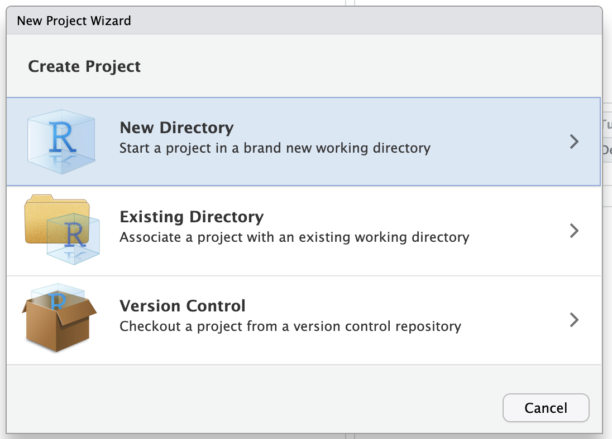
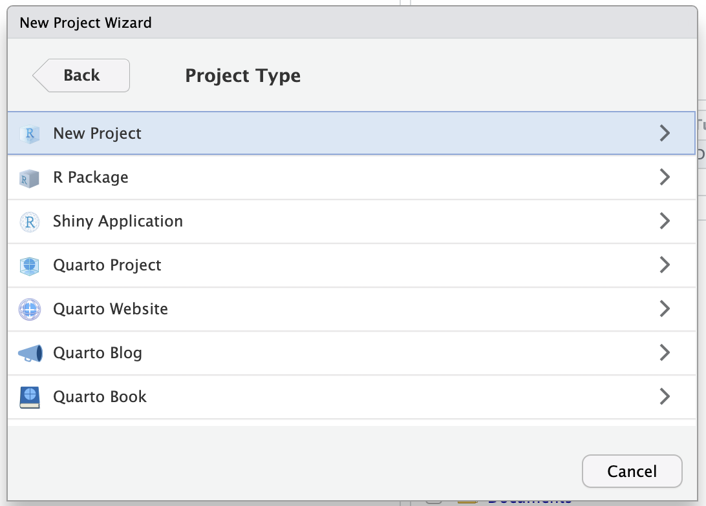
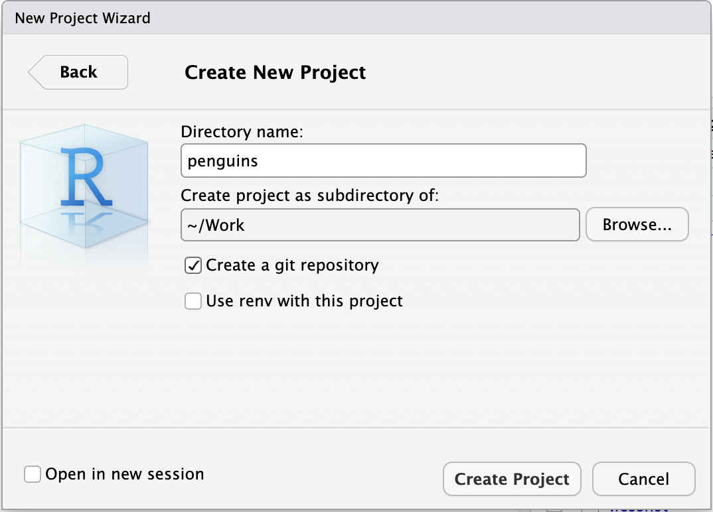
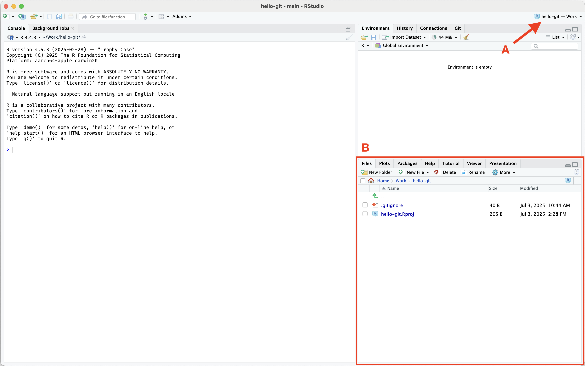

# (PART) Основы {-}

# Создание репозитория {#git-init}

Git может отслеживать изменения в любой папке на вашем компьютере.
Для начала работы достаточно инициализировать Git в этой папке, и вся история и версии будет храниться прямо в ней.
Такая папка называется **Git репозиторием**.

Самый простой способ создать репозиторий --- вместе с проектом RStudio.  
В верхнем меню выберите [File → New Project]{.figtext}.
В появившемся окне выберите [New directory]{.figtext} и далее [New Project]{.figtext}.
На последнем шаге введите, как должна называться папка, в поле [Directory name]{.figtext}.
Папка будет создана по адресу, указанному ниже в поле [Create project as subdirectory of]{.figtext}.  
‼️ Обязательно поставьте галочку напротив опции [<input type="checkbox" disabled /> Create a git repository]{.figtext}. Иначе проект будет создан без Git репозитория.  
После нажатия кнопки [Create Project]{.figtext} окно RStudio перезагрузится с открытым проектом.

<table class="table table-borderless">
    <tr>
        <td>{width="320px"}</td>
        <td>{width="320px"}</td>
    </tr>
    <tr>
        <td>{width="320px"}</td>
        <td>{width="320px"}</td>
    </tr>
</table>

Чтобы убедиться, что проект загружен, обратите внимание на следующие элементы:
В правом верхнем углу должно быть указано название проекта [(A)]{.figref}.
На панели файлов (по умолчанию она находится в нижнем правом углу) должна быть открыта папка с файлами проекта [(B)]{.figref}.

{width="680px"}

Когда в RStudio загружен проект, R и Git ищут файлы в этой папке --- это так называемая **рабочая папка или рабочая область**.

Подробнее про рабочую папку.

На разных компьютерах у разных участников сама папка проекта может находиться в разных местах.
Например, у пользователя с именем `kvoronin` папка может находиться по адресу `/Users/kvoronin/hello-git`.

Но если в скрипте указать полный адрес файла `/Users/kvoronin/hello-git/data/sample.csv`, то он не будет работать на компьютере другого пользователя, например с именем `alebedeva`.

Зато будет работать адрес относительно рабочей папки, т.е. просто `data/sample.csv`.

Рассмотрим созданные RStudio файлы:

- `hello-git.Rproj` (или соответствующий названию проекта, что вы ввели) --- содержит настройки проекта
- `.gitignore` --- содержит некоторые настройки Git, а именно список файлов, которые Git должен игнорировать; [подробнее см. в отдельном разделе](#gitignore)

Если в списке файлов отсутствует `.gitignore`, значит, вы не отметили галочку [<input type="checkbox" disabled /> Create a git repository]{.figtext} при создании проекта или не установили Git ([см. предыдущий раздел](#install)).
Исправьте ошибку и создайте проект заново.

Итак, мы создали проект RStudio с Git репозиторием.
И то, и другое --- просто папка со специальными файлами, в которой мы будем работать дальше.

---

**Вопрос 1. Что такое Git репозиторий?**

- Любая папка на компьютере с установленным Git
- Любая папка в которой инициализирован Git
- Любой проект RStudio
- Папка в которую установлен Git

**Вопрос 2. Что такое рабочая папка?**

- Папка в которой R и Git ищут файлы
- Любая папка в которой может работать Git
- Та в которой я храню файлы связанные с работой
- Все варианты неправильные

**Вопрос 3. Сколько файлов вы видите на панели Files в RStudio?**

*(Для проверки, что все идет по плану.)*

- Ни одного
- Два файла
- Три или четыре файла
- Гораздо больше

---

*(Как-будто сложно? Какие-то репозитории и рабочие папки, можно упростить до "создайте проект" без объяснений. Но возможно термины пригодятся.)*

*(Рассказать что репозиторий это просто папка с папкой .git? Как-будто сложно и необязательно, хотя полезно.)*
