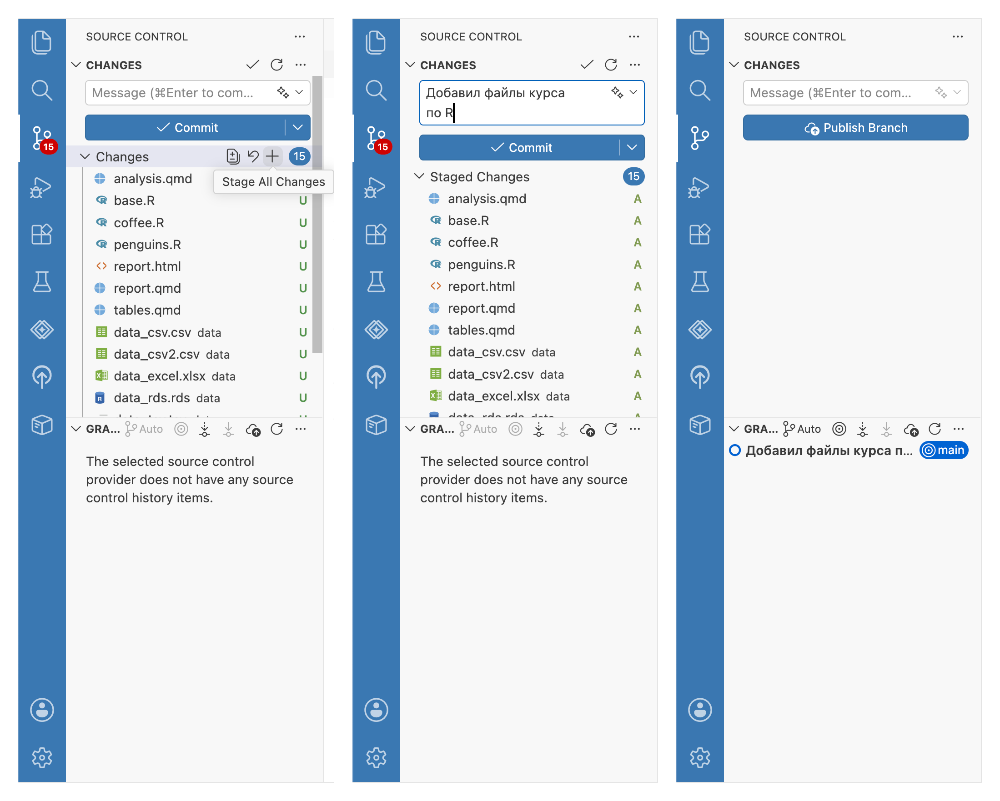

# Отслеживание изменений {#git-commit}

Git отслеживает изменения в файлах, находящихся в рабочей папке.
Но не все подряд, как это делают Блокнот или Word при помощи команд «Отменить» и «Повторить»,
а при помощи версий --- или, в терминах Git, **коммитов (commit)**.
Коммиты нужно создавать вручную, выбирая, какие файлы вы хотите зафиксировать, добавив в версию.

Откройте в Positron панель [Source Control]{.figtext}.
В отличие от панели с файлами [Explorer]{.figtext}, на ней выводятся только те файлы, которые были изменены по сравнению с последней версией (коммитом).
Так как мы еще не создали ни одной версии, то в списке выводятся все файлы проекта.

Чтобы создать коммит (версию), наведите на заголовок [Changes]{.figtext} и нажмите `+`.
После этого файлы окажутся в разделе [Staged Changes]{.figtext} --- **индексе (staging)**,
промежуточной области для выбора файлов, которые войдут в новую версию (коммит).
Можно добавлять файлы и по одному, нажимая `+` только напротив нужных.
Файлы, не добавленные в индекс, останутся в рабочей папке, но не войдут в коммит.
Вы можете добавить их в следующую версию позже или отменить изменения, нажав `↶`.

Введите краткое описание в поле [Message]{.figtext}.
В нашем примере мы закончили курс R, это и будет подходящим описанием: `Добавил файлы курса по R`.
Нажмите кнопку [Commit]{.figtext} под текстовым полем.

{width=100%}

Обратите внимание, теперь панель [Source Control]{.figtext} со списком измененных файлов пуста ---
это значит, что изменений по сравнению с последней версией, которую мы только что создали, нет.


Теперь у нас есть версия проекта, к которой можно вернуться в любой момент и начать работу с этого места.

```{r, include=FALSE}
# Заменить название главы на «Создание коммита»
```
