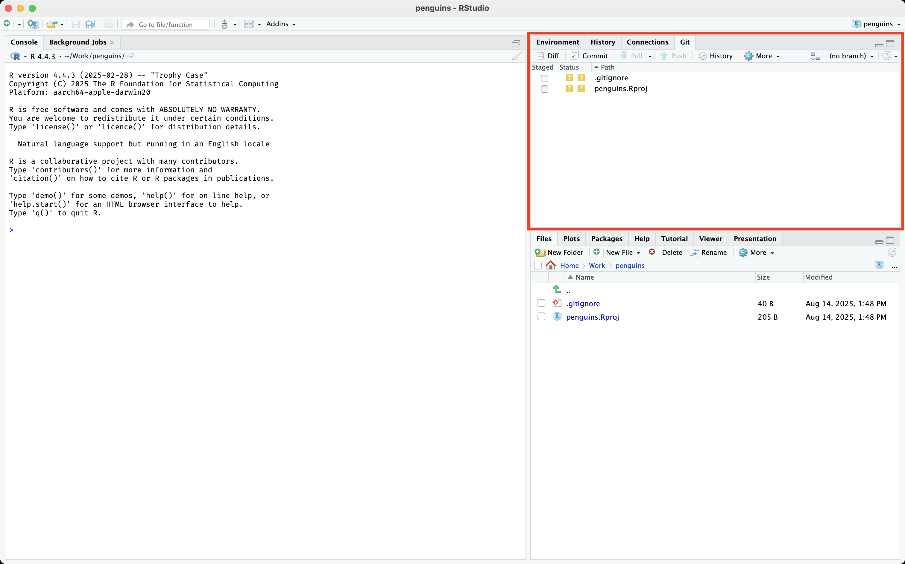
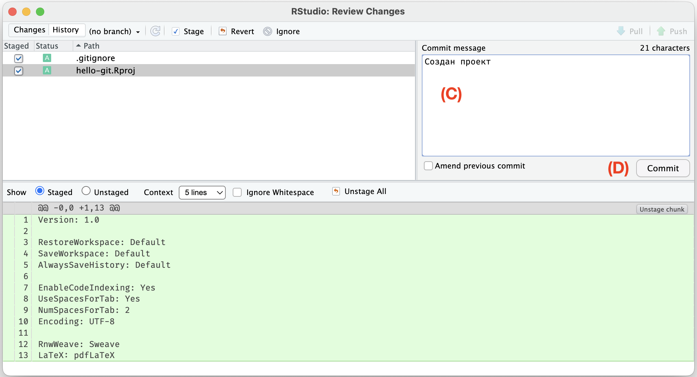

# Отслеживание изменений {#git-commit}

Git отслеживает изменения в файлах, находящихся в рабочей папке.
Но не все подряд, как это делают Блокнот или Word при помощи команд «Отменить» и «Повторить»,
а при помощи версий --- или, в терминах Git, **коммитов (commit)**.
Коммиты нужно создавать вручную, выбирая, какие файлы вы хотите зафиксировать, добавив в версию.

Откройте в RStudio панель с названием [Git]{.figtext} (по умолчанию она в верхнем правом углу).
В отличие от списка файлов, на ней выводятся только те файлы, которые были изменены по сравнению с последней версией (коммитом).
Так как мы еще не создали ни одной версии, то в списке выводятся оба файла, созданных с проектом: `.gitignore` и `penguins.Rproj`


{width=680px}

<details><summary>Нет панели Git?</summary>
Значит, вы не отметили галочку [Create a git repository]{.figtext} при создании проекта или не установили Git.
[Проверьте наличие Git](#install) и [создайте проект заново](#git-init).
</details>

Чтобы создать коммит (версию), отметьте файлы галочкой в столбце [Staged]{.figtext}.
Галочка напротив файла означает, что он добавлен в **индекс (staging)** ---
промежуточную область для выбора файлов, которые будут зафиксированы.
Неотмеченные файлы останутся в рабочей папке, но в коммит не попадут.
Вы можете добавить их в следующую версию позже или отменить изменения.
Нажмите кнопку [Commit]{.figtext}.

{width=400px}

В открывшемся окне можно подробнее посмотреть, что изменилось в файлах.
Просмотрите изменения и введите краткое описание в поле [Commit message]{.figtext}.
В нашем примере был создан проект, это и будет подходящим описанием.
Нажмите кнопку [Commit]{.figtext} под текстовым полем.

{width=600px}

В открывшемся окне не должно быть ошибок, но должно быть сообщение как на изображении ниже.

{width=600px}

Закройте окно с сообщением и окно создания коммита, вернитесь к RStudio.
Обратите внимание, теперь панель [Git]{.figtext} со списком измененных файлов пуста ---
это значит, что изменений по сравнению с последней версией, которую мы только что создали, нет.

{width=400px}

Теперь у нас есть версия проекта, к которой можно вернуться в любой момент и начать работу с этого места.

```{r, include=FALSE}
# Заменить название главы на «Создание коммита»
```
