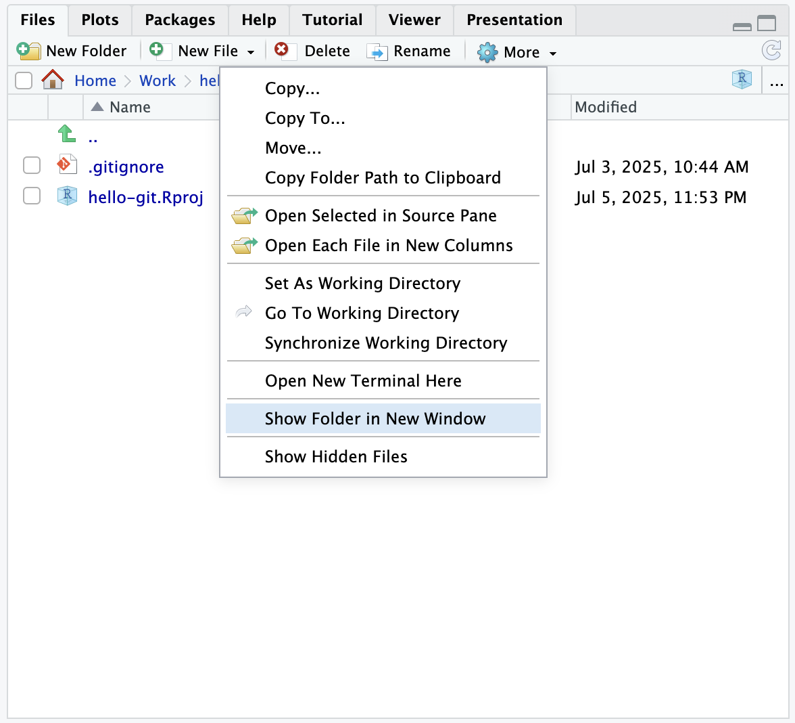
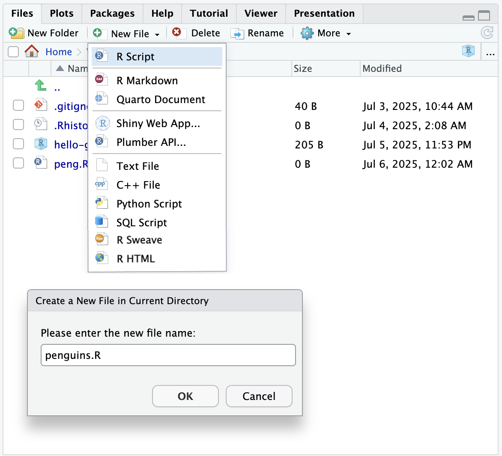
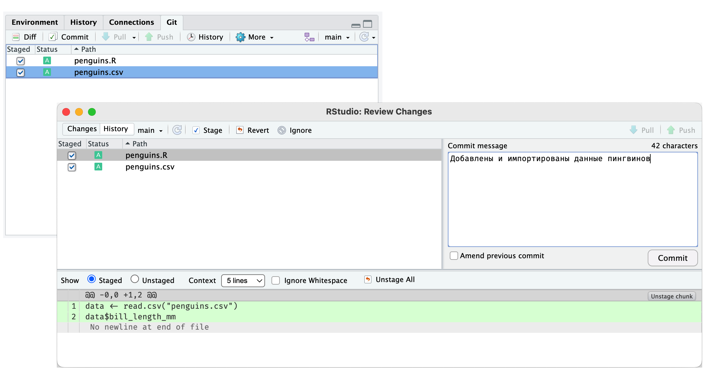

# Практика {#git-commit2}

В предыдущей главе мы научились создавать коммиты (версии).
При работе с Git это нужно делать регулярно --- как правило, после выполнения задачи или её части, или внесения исправлений.
Также коммит можно создать, когда нужно просто зафиксировать изменения, например, в конце рабочего дня или чтобы поделиться с коллегами.

Приступая к работе над задачей, мы начинаем с фиксированной версии проекта, которая работает понятно и предсказуемо, а список изменений пуст.
После выполнения задачи отмечаем нужные изменения для коммита, а лишние убираем.
Проверяем изменения и создаем коммит.
В результате получаем очередную версию и чистый список изменений.

{width=540px}

Такой процесс помогает упорядочить работу и подходит для самых разных проектов, в том числе для анализа данных. Его легко разделить на задачи, результатом выполнения которых будут коммиты.
Попробуем сделать это на практике и проанализируем длину клюва антарктических пингвинов.

## Загрузка данных

Загрузите файл с данными [penguins.csv](https://github.com/yoursdearboy/git-101/releases/download/penguins/penguins.csv) и поместите в папку проекта.
Чтобы открыть папку в файловом менеджере, в меню на панели [Files]{.figtext} выберите [More → Show Folder in New Window]{.figtext}.
Когда вернётесь в RStudio, убедитесь, что файл `penguins.csv` появился на панели [Git]{.figtext}.

{width=400px}

Создайте скрипт для анализа. В меню на панели [Files]{.figtext} выберите [New File → R Script]{.figtext} и введите название файла `penguins.R`

{width=400px}

Скопируйте следующий код для импорта данных и сохраните его в созданном скрипте.
Выделите обе строки и запустите, нажав кнопку [Run]{.figtext} в правом верхнем углу редактора RStudio.
Если импорт данных работает, в консоли появится вектор из чисел.

```r
data <- read.csv("penguins.csv")
data$bill_length_mm
```

Убедитесь в том, что файл скрипта также появился на панели [Git]{.figtext}.
Добавьте оба файла в индекс, отметив галочкой в столбце [Staged]{.figtext}, и создайте коммит.
В окне коммита обязательно проверьте содержимое скрипта `penguins.R`,
так как часто пользователи забывают сохранить файл перед добавлением в индекс.
[Подробную инструкцию по созданию коммита смотри в предыдущей главе.](#git-commit)

{width=690px}

После создания коммита список измененных файлов на панели [Git]{.figtext} должен быть пуст.

## Визуализация

Анализ новых данных полезно начинать с исследования их распределения.
Мы построим несколько вариантов гистограммы длины клюва с разной шириной столбца.
Сохраните приведённый ниже код в файл скрипта, запустите его и посмотрите графики.

```r
data <- read.csv("penguins.csv")
x <- data$bill_length_mm

hist(x, breaks = seq(40, 60, 4))
hist(x, breaks = seq(40, 60, 2))
hist(x, breaks = seq(40, 60, 1))
```

Файл `penguins.R` снова появился в списке измененных файлов на панели [Git]{.figtext}.
Добавьте его в индекс, в окне коммита проверьте изменения и создайте новый коммит с описанием
«Добавили гистограммы для длины клюва».

## Экспорт

Гистограмма с шириной столбца 2 выглядит наиболее информативно.
Такой график можно даже опубликовать.
Для того чтобы экспортировать изображение, сохраните следующий код в файл скрипта и выполните его.

```r
data <- read.csv("penguins.csv")
x <- data$bill_length_mm

png("penguins-hist.png")
hist(x, breaks = seq(40, 60, 2))
dev.off()
```

После выполнения скрипта в списке файлов на панели [Git]{.figtext} появится файл с изображением `penguins-hist.png`.
Его мы тоже добавим в коммит.  
Во-первых, так другие участники сразу увидят результат, не запуская скрипт.
Во-вторых, если вы измените ширину столбца или другие настройки графика, будет удобно сравнить старую и новую версии.

Добавьте оба файла в индекс и создайте из них коммит с описанием «Сохранили гистограмму длины клюва».

## {-}

::: {.callout .callout-info}
Делайте коммиты часто. Не придавайте слишком большое значение планированию. Коммит это не новая версия вашего анализа, а просто шаг или некоторые изменения, которые вы хотите зафиксировать. При необходимости можно объединить несколько коммитов в один ([см. в разделе с решением частых задач](#faq)).
:::

::: {.callout .callout-info}
Не обязательно добавлять в коммит все измененные файлы сразу *(или отменять изменения)* --- они могут оставаться в рабочей папке сколько угодно.
Тем не менее старайтесь не копить изменения, потому что тогда версия, зафиксированная в Git, и версия, с которой вы работаете, будут отличаться, а значит, теряется смысл системы контроля версий.
Вы всегда можете посмотреть, какие файлы были изменены, и при необходимости отменить изменения в следующем коммите.
:::

Мы выполнили несколько шагов и теперь можем посмотреть, как менялся проект средствами Git.

```{r, include=FALSE}
# Показать как отменить изменения.
```

```{r, include=FALSE}
# Как писать сообщение коммита.
```
