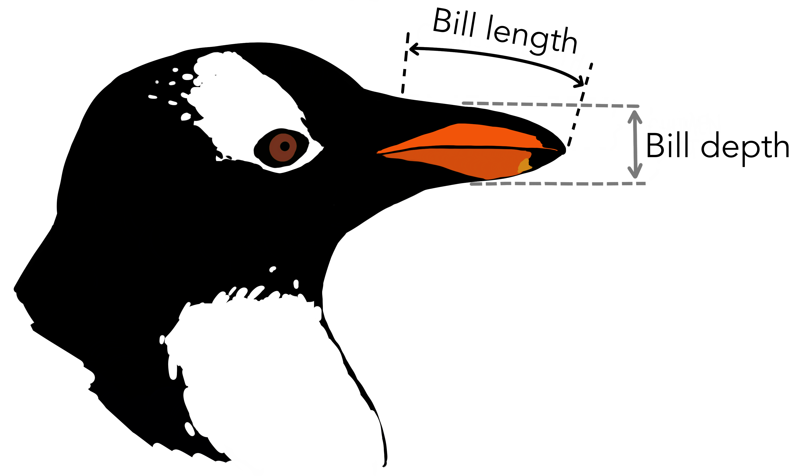

# Рабочий процесс {#git-commit2}

```{r, include=FALSE}
# Показать как отменить изменения.
```

В предыдущем разделе мы разобрали, как зафиксировать изменения в файлах, создав коммит (версию).

При работе с Git это необходимо делать регулярно.
Мы начинаем работу с некоторой фиксированной версией анализа, которая работает понятно и предсказуемо. Список изменений пуст. В ходе работы мы вносим изменения в файлы. Выполнив очередной шаг, мы отмечаем нужные изменения для фиксации (коммита), а ненужные убираем. Проверяем содержимое и создаем коммит. Получилась очередная рабочая версия и чистый список изменений относительно нее.

{width=350px}

Анализ данных хорошо укладывается в этот процесс, потому что легко разделяется на шаги.
Шаги превращаются в коммиты, которые можно проконтролировать, вернуться к ним или поделиться с другими участниками.

Попробуем на практике --- проанализируем длину клюва пингвина.

{width=400px}

Скачайте файл с данными [penguins.csv](https://github.com/yoursdearboy/git-101/releases/download/penguins/penguins.csv) и положите в папку проекта.
Для этого откройте папку в файловом менеджере или воспользуйтесь меню на панели [Files]{.figtext} в RStudio [More → Show Folder in New Window]{.figtext}

{width=400px}

Обратите внимание, что файл `penguins.csv` появился на панели [Git]{.figtext} в RStudio.

Теперь создадим скрипт для анализа. Для этого на панели [Files]{.figtext} выберите в меню [New File → R Script]{.figtext} и введите название файла `penguins.R`

{width=400px}

Введите следующий код и сохраните файл:

```r
data <- read.csv("penguins.csv")
data$bill_length_mm
```

Запустите код и убедитесь, что он работает.
Убедитесь, что оба файла появились на панели [Git]{.figtext}.
Отметьте их и создайте коммит. [Подробную инструкцию см. в предыдущей главе.](#git-commit)

{width=400px}

После создания коммита убедитесь, что список измененных файлов на панели [Git]{.figtext} пуст.

Начиная работать с новыми данными, хорошая идея первым делом исследовать их при помощи графика. Построим гистограмму (несколько вариантов с разной шириной столбца). Перепишите скрипт следующим образом:

```r
data <- read.csv("penguins.csv")
x <- data$bill_length_mm

hist(x, breaks = seq(40, 60, 4))
hist(x, breaks = seq(40, 60, 2))
hist(x, breaks = seq(40, 60, 1))
```

Сохраните файл. Обратите внимание, что он снова появился в списке измененных файлов на панели [Git]{.figtext}. Отметьте его, проверьте изменения и создайте новый коммит.
*Не забудьте убедиться, что измененная версия скрипта работает.*

Ширина столбца 2 подходит лучше всего. Такую гистограмму можно и опубликовать. Для этого сохраним изображение в файл.
Перепишите скрипт следующим образом:

```r
data <- read.csv("penguins.csv")
x <- data$bill_length_mm

png("penguins-hist.png")
hist(x, breaks = seq(40, 60, 2))
dev.off()
```

Сохраните скрипт. Выполните код. Обратите внимание, что на панели [Git]{.figtext} в списке файлов появился файл с изображением `penguins-hist.png`. Его мы тоже добавим в коммит.  
Во-первых, это позволит другим участникам ознакомиться с результатами без необходимости запускать скрипт.  
Во-вторых, позже вы можете изменить ширину столбца, тогда удобно будет сравнить результат.
Отметьте оба файла и создайте коммит.

::: {.alert .alert-info}
Делайте коммиты часто. Не придавайте слишком большое значение планированию. Коммит это не новая версия вашего анализа, а просто некоторые изменения или шаг, которые вы хотите зафиксировать. При необходимости можно объединить несколько коммитов в один ([см. в разделе с решением частых задач](#faq)).
:::

::: {.alert .alert-info}
Не обязательно добавлять в коммит все измененные файлы сразу *(или отменять изменения)* --- они могут оставаться в рабочей папке сколько угодно.
Тем не менее старайтесь не копить изменения, потому что тогда версия, зафиксированная в Git, и версия, с которой вы работаете, будут отличаться, а значит, теряется смысл системы контроля версий.
Вы всегда можете просмотреть, какие файлы были изменены, и при необходимости отменить изменения в следующем коммите.
:::

Итак, мы выполнили несколько шагов анализа данных. Давайте посмотрим на сделанные изменения [с помощью средств Git](#git-log).

---

*(Так себе название главы.)*
