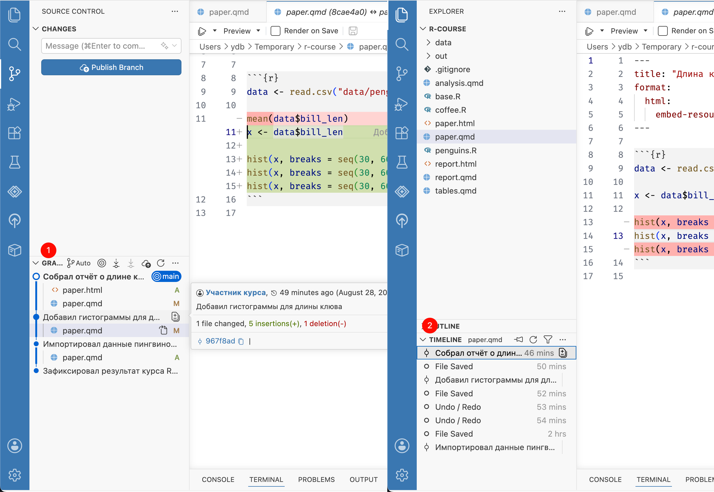

# Просмотр истории {#git-log}

До этого мы просматривали изменения только по сравнению с последней версией в момент создания коммита. Предыдущие коммиты можно посмотреть в **журнале (log)**.

Журнал позволяет изучить изменения от других участников или вспомнить свои собственные, и зачем они сделаны.
Поэтому так важно писать ясные и содержательные описания коммитов.
Используя журнал, можно найти, когда сделаны изменения, приведшие к ошибке, и вернуть проект к предыдущему состоянию.
В конце концов, его можно использовать для отчетности и бизнес-аналитики по проекту.

Чтобы открыть журнал, на панели [Source Control]{.figtext} разверните раздел [Graph]{.figtext} внизу.
В открывшемся окне выводится список коммитов в обратном порядке --- последние коммиты находятся вверху.

При наведении на коммит появляется краткая информация: имя автора, которое [мы указали в настройках](#setup), дата и описание и, самое важное — хэш коммита, его уникальный идентификатор. В примере это `967f8ad`, у вас он будет другим.

Кликните на коммит, чтобы посмотреть список изменений. Выберите файл, чтобы открыть дифф --- изменения, сделанные в этом коммите по сравнению с предыдущей версией.

{width=100%}

Если нужна история только одного файла, выберите его на панели [Explorer]{.figtext} и откройте раздел [Timeline]{.figtext} внизу той же панели.
Выберите коммит, чтобы посмотреть изменения.
В разделе [Timeline]{.figtext} также есть автоматические контрольные точки, которые создаются при сохранении файла. Они не входят в Git-репозиторий и исчезнут через некоторое время.

Даже если вы работаете в одиночку, полезно иметь под рукой историю изменений.
Но по настоящему эта функция полезна,
когда приходится работать с несколькими версиями одновременно,
например при работе в команде.
[Об этом далее](#git-branch).

```{r, include=F}
# Название главы что-то типа «Журнал (log)»?

# примеры? код ревью, просто посмотреть кто, когда и зачем.
# рассказать почему в списке выводится только первые 8 символов sha?
```
