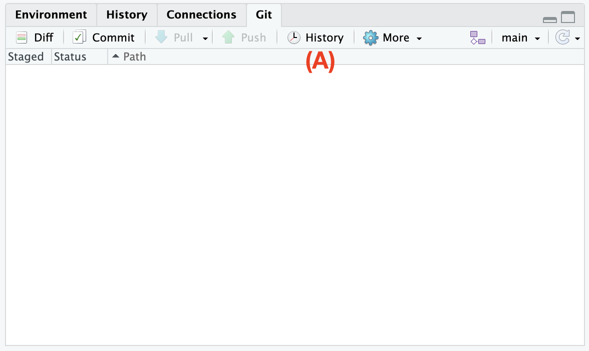
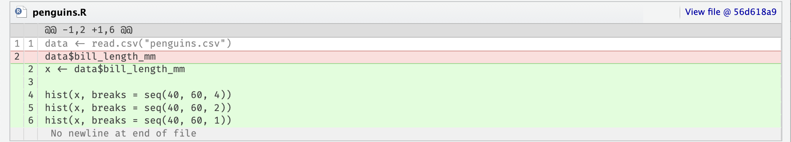

# Просмотр истории {#git-log}

До сих пор мы просматривали изменения только во время работы --- относительно последней версии.
Git позволяет отследить всю историю, начиная с самого первого коммита.
Это полезно, чтобы вспомнить, какие изменения были внесены и по каким причинам (своего рода документация) или найти, в какой момент возникла ошибка и как вернуть код к предыдущему состоянию.

Чтобы открыть окно истории, нажмите кнопку [History]{.figtext} на панели [Git]{.figtext} [(A)]{.figref}

{width=400px}

В открывшемся окне выводится список коммитов в обратном порядке с краткой информацией.
Под списком находится подробная информация по выбранному коммиту.

{width=600px}

- SHA --- так называемый хэш коммита, который служит его уникальным идентификатором в репозитории
- Author --- автор коммита \<его email\>, [которые были указаны в главе настройка](#setup)
- Date --- дата и время коммита
- Subject --- краткое описание сделанных изменений, написанное автором коммита
- Parent --- хэш (идентификатор) предыдущего коммита

Еще ниже показаны изменения, сделанные в рамках этого коммита.
Выводятся только те строки, которые были изменены, а также несколько строк выше и ниже, чтобы был понятен контекст.
Добавленные строки выделены зеленым цветом, а удаленные --- красным.
Неизмененные строки, приведенные для контекста, не выделяются.
Такой формат вывода изменений называется **«дифф» (diff)** и часто используется для отображения изменений.

Выберите в списке следующий коммит (на изображении выше он называется [Построили гистограммы для длины клюва]{.figtext}) и изучите изменения.
Обратите внимание, что Git анализирует строки целиком, а не отдельные слова или символы.
Поэтому получился следующий дифф, где старая вторая строка была удалена, а новая вторая строка добавлена (см. номера строк слева), хотя мы всего лишь добавили `x <- ` в ее начало.

{width=600px}

Даже если вы работаете в одиночку, очень удобно иметь под рукой историю.
Но по настоящему эта функция полезна, когда приходится работать с несколькими версиями одновременно, например при работе в команде.
[Об этом далее](#git-branch).

```{r, include=F}
# примеры? код ревью, просто посмотреть кто, когда и зачем.
# рассказать почему в списке выводится только первые 8 символов sha?
```
