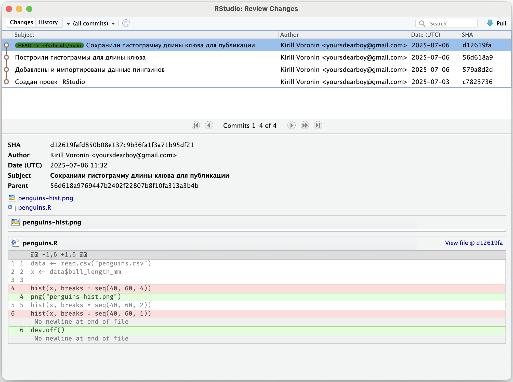

# Просмотр истории {#git-log}

До этого мы просматривали изменения только по сравнению с последней версией в момент создания коммита.
С помощью **журнала (log)** можно увидеть все предыдущие коммиты.
Это полезно, чтобы вспомнить, какие изменения были внесены и по каким причинам (поэтому важно писать содержательные описания коммитов) или найти, в какой момент возникла ошибка и как вернуть код к предыдущему состоянию.

Чтобы открыть журнал, нажмите кнопку [History]{.figtext} на панели [Git]{.figtext}. В открывшемся окне выводится список коммитов в обратном порядке с краткой информацией.
Под списком находится подробная информация по выбранному коммиту.

{width=690px}

- SHA --- так называемый хэш коммита, который является его уникальным идентификатором в репозитории
- Author --- автор коммита \<email\>, [которые были указаны в настройках](#setup)
- Date --- дата и время создания коммита
- Subject --- описание коммита
- Parent --- хэш (идентификатор) предыдущего коммита

Еще ниже показан дифф --- изменения, сделанные в этом коммите по сравнению с предыдущим.
Для больших файлов выводятся только те строки, которые поменялись, а также несколько строк выше и ниже, чтобы был понятен контекст.

Даже если вы работаете в одиночку, полезно иметь под рукой историю изменений.
Но по настоящему эта функция полезна,
когда приходится работать с несколькими версиями одновременно,
например при работе в команде.
[Об этом далее](#git-branch).

```{r, include=F}
# примеры? код ревью, просто посмотреть кто, когда и зачем.
# рассказать почему в списке выводится только первые 8 символов sha?
```
