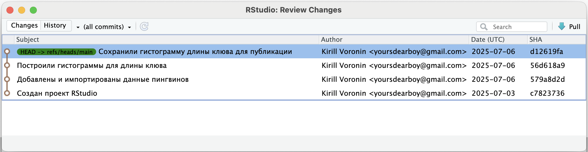
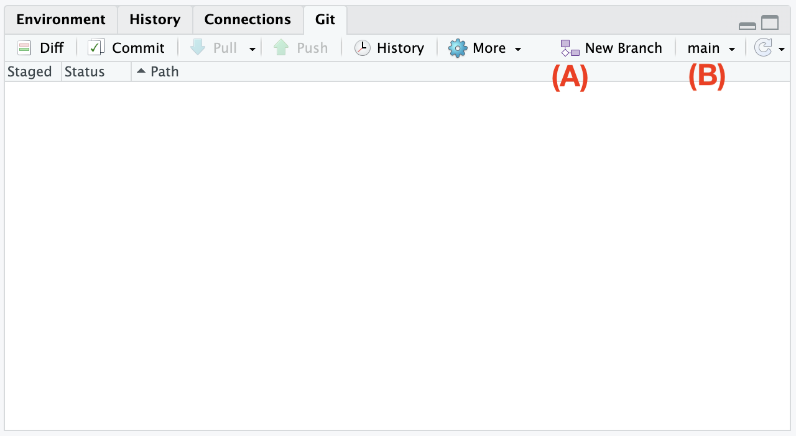
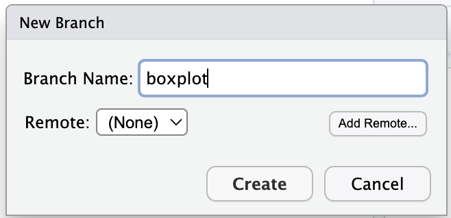
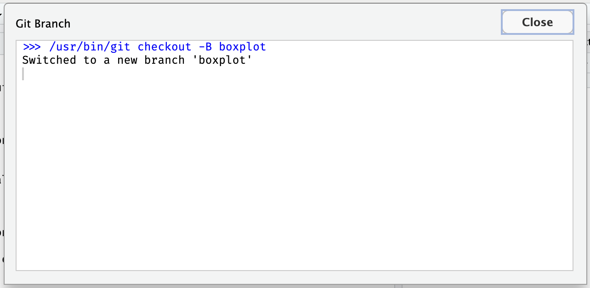
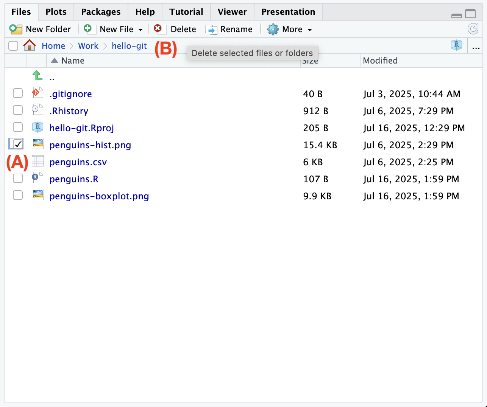
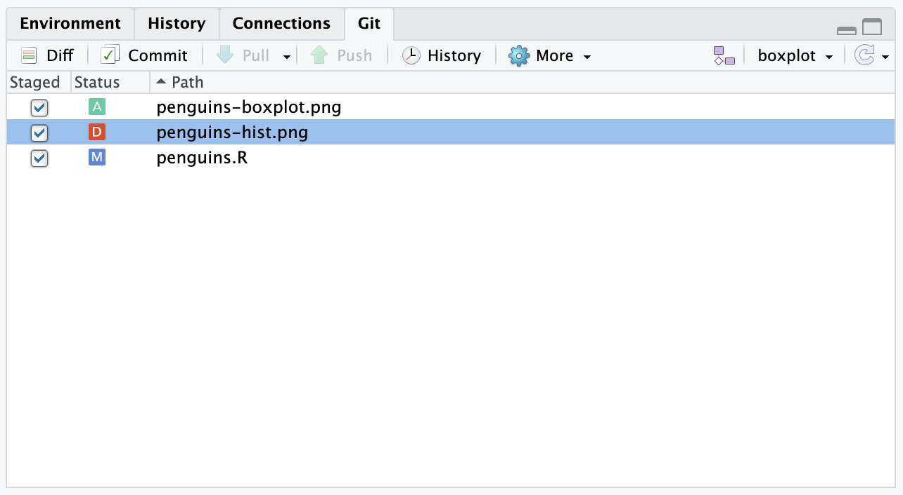

# (PART) Ветки {-}

```{r, include=FALSE}
# Ветка отражает состояние проекта во времени.
# Ветки можно делать от веток.
```

# Введение {#branch}

До этого мы создавали версии только последовательно,
чтобы записывать историю изменений.
Git позволяет создавать параллельные версии.
Это могут быть как версии различных участников (collaborators) с различных устройств,
так и несколько альтернативных версий на одном и том же компьютере.
Таким образом участники могут создавать и обмениваться различными вариантами изменений.
Git позволяет эффективно объединять эти изменения, делая совместную работу комфортной,
чего, к слову, не умеют облачные сервисы вроде Google Drive.

Для этого используются так называемые ветки (branch).
Почему ветки? Потому что начиная с выбранного коммита история изменений разветвляется.

По умолчанию, мы работаем в ветке `main`
(ранее ветка по умолчанию называлась `master`, будьте готовы встретить и такое название).
Ее можно сравнить со стволом дерева --- вот он слева на изображении.
В нашем проекте с пингвинами в ветке `main` 4 коммита, последний из которых содержит гистограмму для публикации.

{width=600px}

Представим ситуацию --- из журнала приходит ответ Рецензента 2, в котором он просит заменить гистограмму на ящик с усами.
С одной стороны, можно податься в журнал, где знают, что такое гистограмма,
с другой, можно хотя бы попробовать удовлетворить пожелания рецензента и,
если нам не понравится новая диаграмма, просто удалить изменения.

# Создание ветки {#git-branch}

Чтобы спокойно поэкспериментировать создадим новую ветку.
Так будет проще удалить изменения и они не будут мешать, если мы захотим поправить что-то действительно важное в основной ветке `main`.

В RStudio нажмите кнопку [New Branch]{.figtext} [(A)]{.figref}

{width=400px}

В появившемся окне введите название, например `boxplot` и нажмите кнопку [Create]{.figtext}.
Откроется окно с сообщением, что мы переключились на ветку `boxplot`,
можете закрыть его кнопкой [Close]{.figtext}.

{width=200px}

{width=400px}

Обратите внимание, что название ветки на панели [Git]{.figtext}, рядом с кнопкой создания ветки [(A)]{.figref}, поменялось с `main` на `boxplot`.

Вернемся к пингвинам.
Замените содержимое скрипта `penguins.R` на следующее:

```r
data <- read.csv("penguins.csv")
x <- data$bill_length_mm

png("penguins-boxplot.png")
boxplot(x)
dev.off()
```

Сохраните файл и выполните скрипт.
Обратите внмание, что мы поменяли название файла.
Старый файл `penguins-hist.png` в этой версии нам не нужен и его необходимо удалить.
Не переживайте, благодаря Git, в основной ветке `main` он останется.
На панели [Files]{.figtext} отметьте галочкой файл `penguins-hist.png` [(A)]{.figref} и нажмите кнопку [Delete]{.figtext} [(B)]{.figref}.

{width=400px}

Отметьте все изменения для фиксации и создайте коммит.
Обратите внимание, что удаление файла это тоже изменение, которое надо отметить.

{width=400px}

Теперь отложим эксперименты и вернемся к прежней версии.
