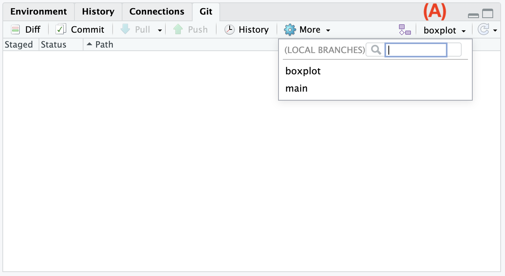
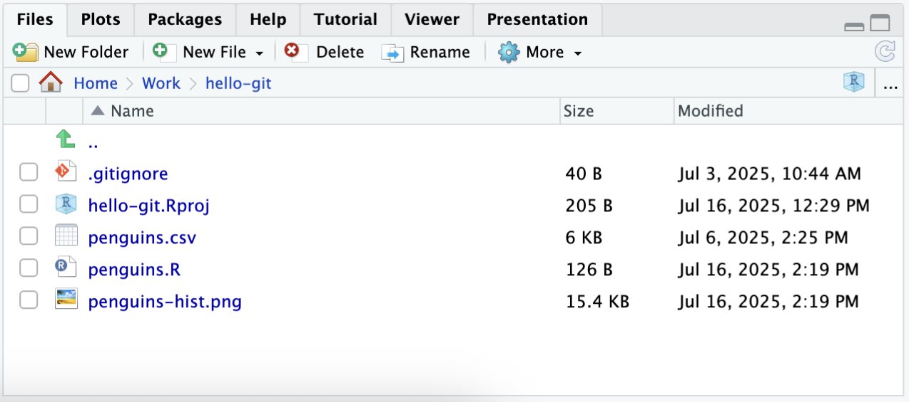
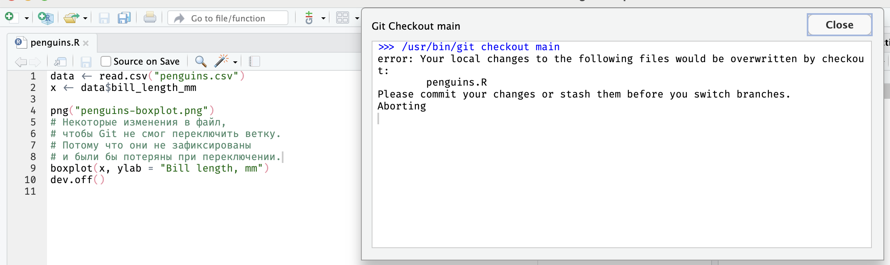

# Переключение веток {#git-checkout}

Для переключения ветки нажмите на название текущей ветки [(A)]{.figref} на панели [Git]{.figtext}.
В выпадающем списке выберите ветку, на которую хотите переключиться (`main`).

{width=400px}

Убедитесь, что код скрипта вернулся к прежнему состоянию и строит гистограмму,
а в списке файлов находится файл с гистограммой `penguins-hist.png` и нет файла `penguins-boxplot.png`.

{width=400px}

Это было просто.
Но есть один случай, когда
Git откажется переключать ветку: если это приведет к потере данных.

Например, замените содержимое скрипта `penguins.R` на следующее (добавилась подпись оси X):

```r
data <- read.csv("penguins.csv")
x <- data$bill_length_mm

png("penguins-hist.png")
hist(x, breaks = seq(40, 60, 2), xlab = "Bill length, mm")
dev.off()
```

Сохраните файл и попробуйте переключиться на ветку `boxplot`.
Вы получите сообщение, как на скриншоте ниже.
Если бы Git переключил ветку, ему бы пришлось перезаписать файл `penguins.R`, в который мы внесли изменения, будучи в ветке `main`, но не зафиксировали.
Поэтому, чтобы не потерять изменения при переключении, сначала необходимо их зафиксировать, создав коммит.

{width=690px}

Создайте коммит и после этого попробуйте переключиться на ветку `boxplot`, а затем обратно на ветку `main`.
