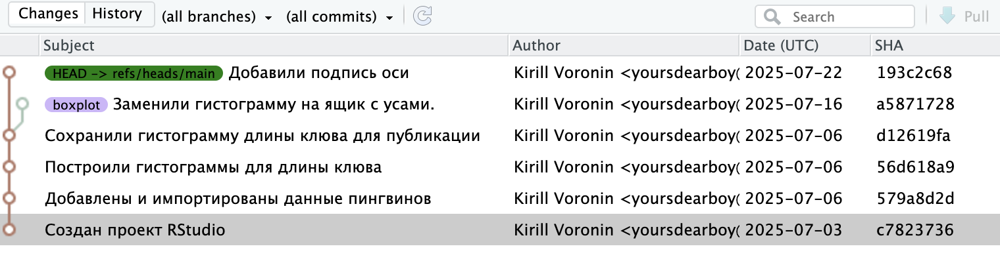
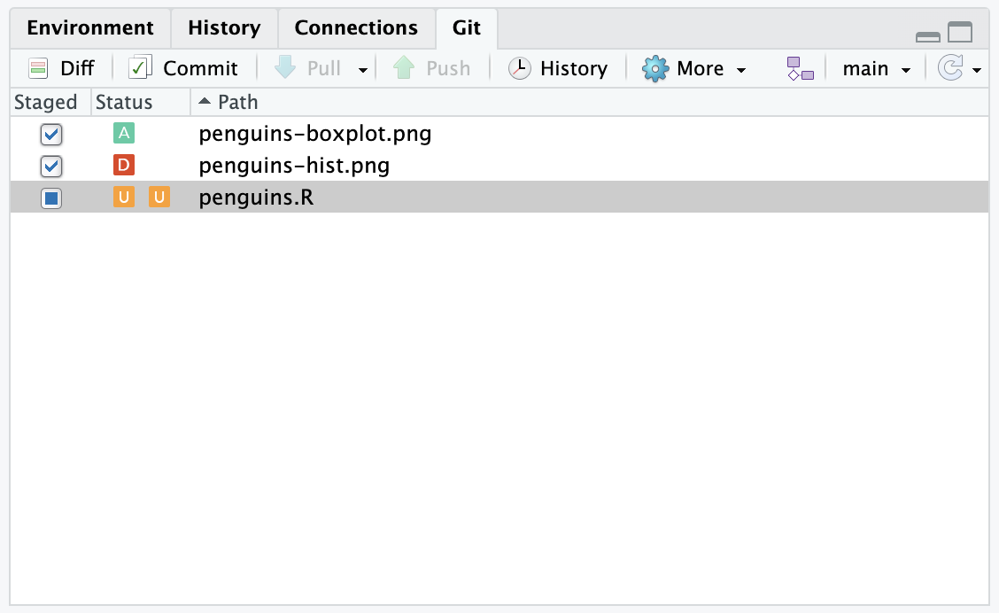
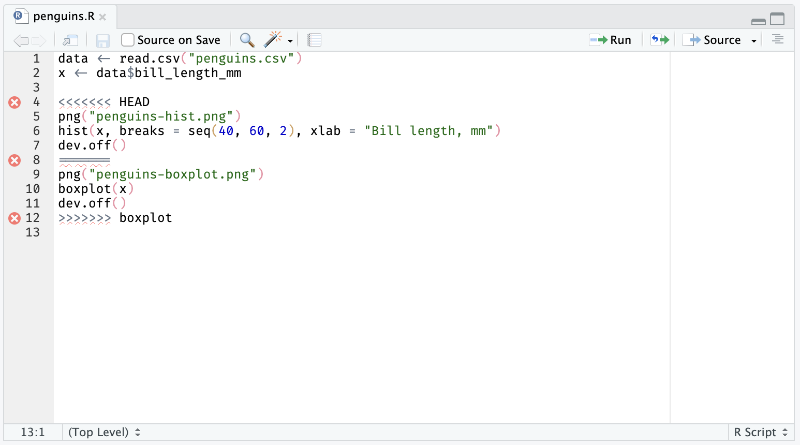
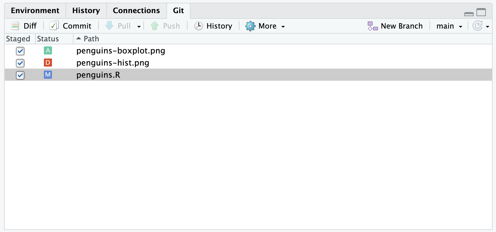
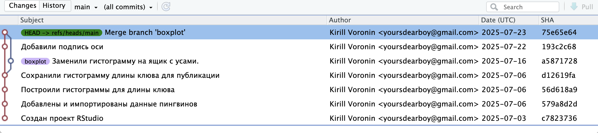

# Слияние веток {#git-merge}

[Откройте окно истории](#git-log) и выберите в фильтре сверху показывать все ветки [(all branches)]{.figtext} и все коммиты [(all commits)]{.figtext}.
На диграмме наглядно видно почему это называется веткой.

{width=690px}

Если мы или другой участник проекта, решим принять эти изменения в основную ветку `main`,
нам нужно выполнить операцию «слияния» (merge).
В RStudio нет встроенной возможности слияния веток, это необходимо делать в терминале.
К счастью, команда совсем не сложная.

Для начала переключитесь на ветку, в которую будут вливаться изменения ---
в нашем случае это `main` ([см. переключение веток](#git-checkout)).
Откройте терминал ^[В меню RStudio выберите Tools → Terminal → New Terminal] и введите команду для слияния с веткой `boxplot`.

```sh
git merge boxplot

```

Git попытается автоматически объединить изменения из обеих веток и создать новый коммит.
В большинстве случаев этого достаточно,
но любая совместная работа может приводить к конфликтам ---
когда в обеих ветках была изменена одна и та же строка, но разным образом.
Какую версию предпочтет Git?
Git предпочтет выдать ошибку и попросит вас разрешить конфликт.

В списке изменений мы видим,
что Git автоматически выбрал изменения связанные с новым и старым файлом для графика
`penguins-hist.png` и `penguins-boxplot.png`,
но лишь частично для скрипта `penguins.R`.

{width=400px}

Причина в том, что мы вносили изменения в код графика в ветке `main` после того как изменили его в ветке `boxplot`.
Откройте файл `penguins.R`.
Git любезно оставил для нас обе версии кода разделив специальными символами.
После строки `<<< HEAD` идет версия из текущей ветки,
строка `===` отделяет две версии друг от друга,
а строка `>>> boxplot` завершает версию из ветки `boxplot`.

{width=690px}

Наша задача переписать выделенный участок (строки 4-12) в одну версию и убрать спецсимволы.
Важно понимать, что Git просто вставил в скрипт кусок текста,
но это все еще обычный R скрипт и мы должны привести его в рабочее состояние.

Нам нужна версия из ветки `boxplot`, но мы хотим добавить в нее подпись оси, как это было сделано в ветке `main`.
Для этого оставим нижнюю версию (строки 9-11) и удалим лишние строки (4-8 и 12)
и добавим подпись, только для ящика с усами это должна быть подпись оси Y.
В итоге должен получиться следующий код.

```r
data <- read.csv("penguins.csv")
x <- data$bill_length_mm

png("penguins-boxplot.png")
boxplot(x, ylab = "Bill length, mm")
dev.off()
```

Сохраните файл и выполните скрипт.
Создайте коммит и
не забудьте отметить галочкой внесенные изменения,
в том числе обновившийся файл `penguins-boxplot.png`, который теперь содержит подпись оси.
Обычно сообщение коммита о слиянии веток содержит следующий текст «Merge branch название-ветки», но можете придумать свое.

{width=400px}

Итак, мы успешно слили изменения из ветки `boxplot` в основную ветку `main`.
Теперь можно продолжить работу в основной ветке.
Еще лучше будет создать очередную ветку для новых изменений, выполнить работу в ней и точно так же слить в основную.

{width=690px}

<details><summary>Как удалить ветку?</summary>
Слитую ветку можно удалить.
В RStudio для этого нет встроенных средств, поэтому придется использовать терминал.
Выполните команду:

```sh
git branch -d boxplot
```

Если ветка не была слита, Git откажется ее удалять, ведь могут быть потеряны сделанные в ней изменения.
Если вы действительно уверены, что они вам не нужны и вы хотите удалить не слитую ветку, выполните команду:

```sh
git branch -D boxplot
```
</details>
