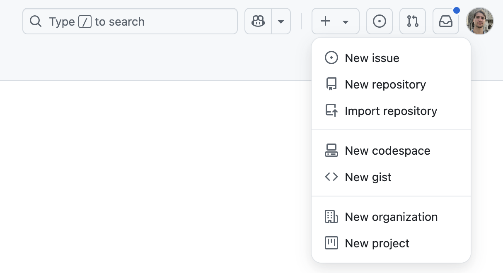
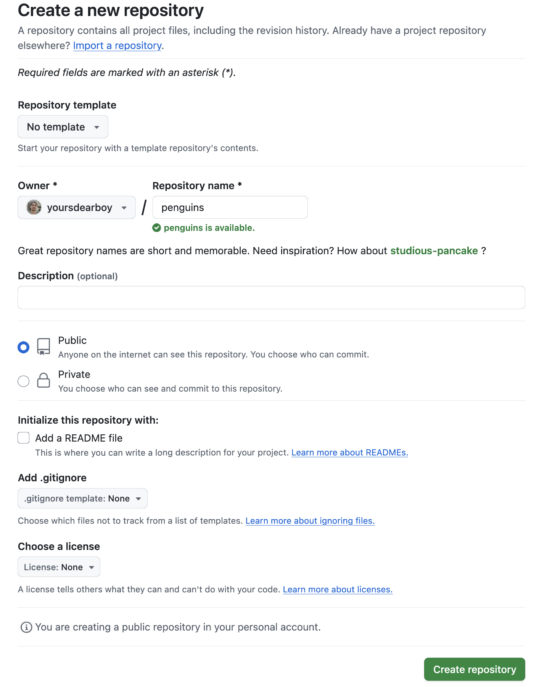
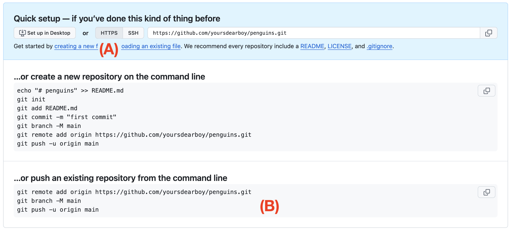
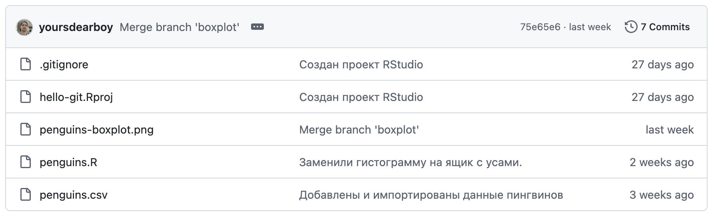

# Удаленный репозиторий {#git-remote}

```{r, include=FALSE}
# Рассказать про видимость репозиториев
```

Для загрузки репозитория с вашего компьютера (он называется локальный репозиторий) на Github необходимо создать удаленный репозиторий на сайте.
На верхней панели в правом углу нажмите кнопку [+]{.figtext} и выберите пункт [New repository]{.figtext}.

{width=400px}

В открывшейся форме достаточно заполнить только название репозитория в поле **Repository name**, например, `penguins`.
Остальные поля оставьте по умолчанию --- мы только разберем за что они отвечают:

- Description --- краткое описание репозитория
- Public / Private --- настройка доступа
  - Public --- кто угодно сможет просматривать ваши файлы, но только отдельно добавленные пользователи смогут их изменять
  - Private --- только отдельно добавленные пользователи смогут просматривать и изменять файлы
- Initialize this repository with --- этот раздел позволяет добавить в создаваемый репозиторий несколько типовых файлов `README`, `.gitignore` и `LICENSE`; не отмечайте ни один из них, потому что в нашем репозитории на компьютере уже есть некоторые из них и они будут конфликтовать с этими.

Внизу страницы нажмите [Create repository]{.figtext}.

<details><summary>Пример заполненной формы</summary>
{width=600px}
</details>

*Удалить это? Там и так на форме все написано, только что на англ. Оставить только предупреждение, чтобы не жали Initialize this repository with.*

*Со скрином формы репозитория тоже ту мач?*

Для созданного репозитория GitHub сгенерировал набор команд быстрой настройки, воспользуемся ими.
Сначала необходимо убедиться, что напротив адреса репозитория выбрана опция доступа через [HTTPS]{.figtext} [(A)]{.figref}.
Далее скопируйте все три команды из раздела для существующего репозитория (**... or push an existing repository from the command line**, [B]{.figref}) и выполните их в терминале на своем компьютере ^[В меню RStudio выберите Tools → Terminal → New Terminal].
На запрос пароля скопируйте и вставьте сгенерированный в предыдущей главе токен.

{width=100%}

```{r, include=FALSE}
# <details><summary>В чем разница между HTTPS и SSH?</summary>
# </details>
```

Мы связали наш локальный репозиторий с удаленным при помощи команды **remote add** --- это необходимо сделать один раз.
И выполнили команду **push**, чтобы отправить сделанные фиксации из локального в удаленный репозиторий, --- это необходимо делать регулярно, и это можно делать через терминал или с помощью специальной кнопки [Push]{.figtext} в интерфейсе RStudio на панели [Git]{.figtext}.
Если команды выполнились успешно, файлы будут загружены на GitHub.
Обновите страницу репозитория на GitHub и проверьте содержимое файлов.

{width=100%}
