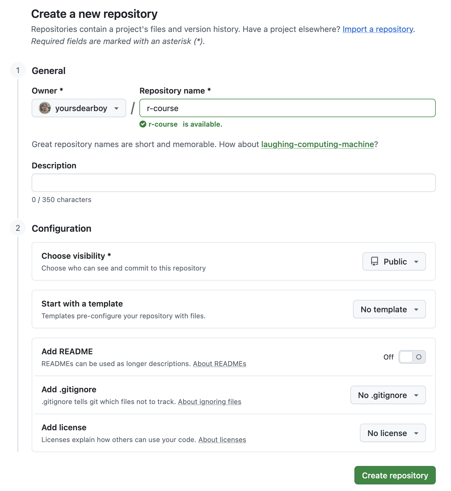
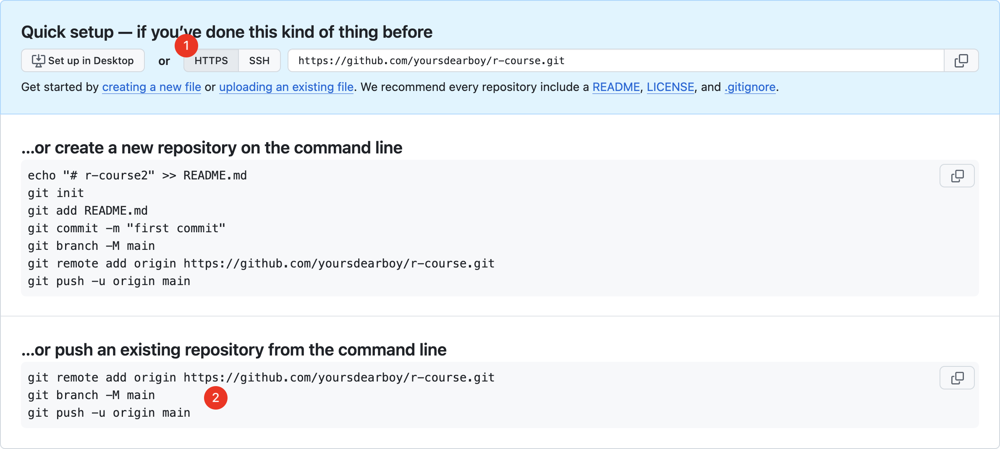
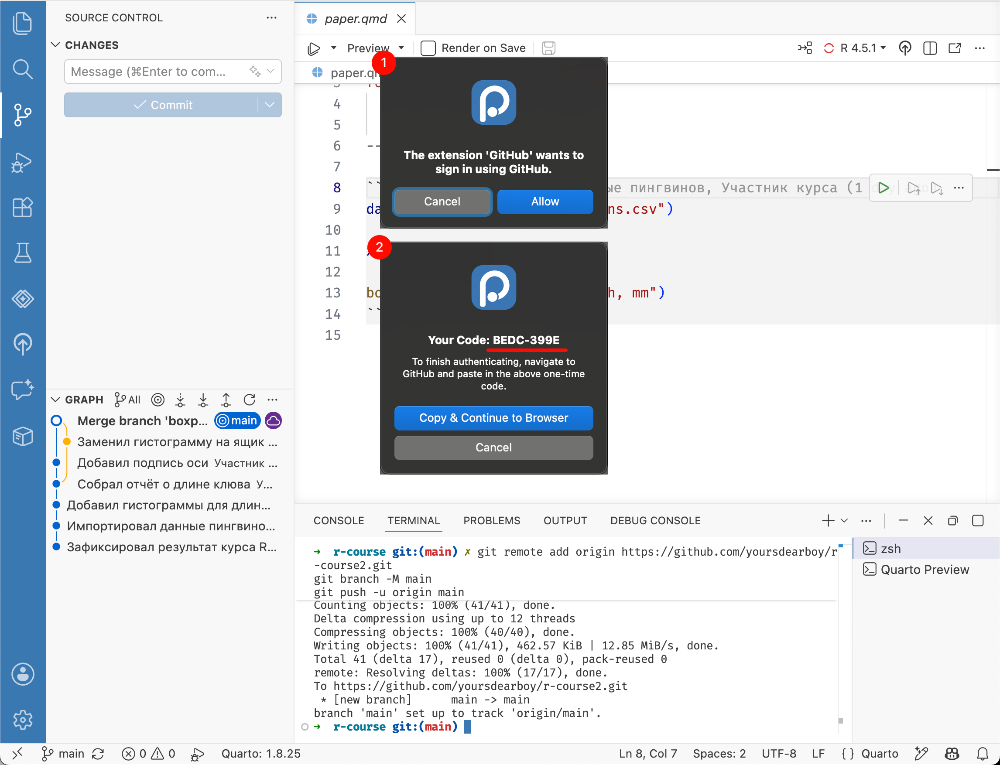
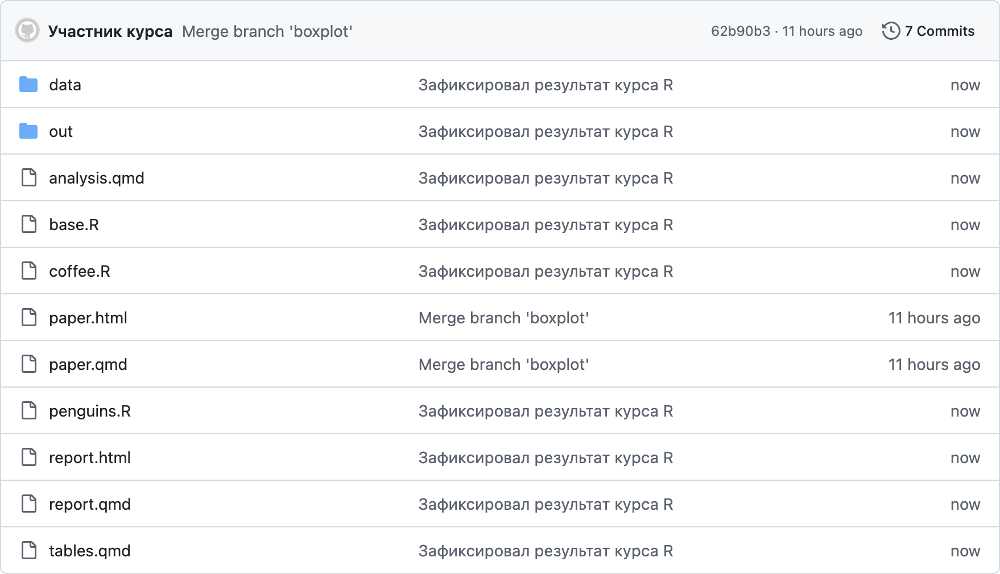

# Удалённый репозиторий {#git-remote}

```{r, include=FALSE}
# Рассказать про видимость репозиториев
```

Для загрузки репозитория с вашего компьютера (он называется локальный репозиторий) на Github необходимо создать удаленный репозиторий на сайте.
На верхней панели в правом углу нажмите кнопку [+]{.figtext} и выберите пункт [New repository]{.figtext}.

{width=400px}

В открывшейся форме достаточно заполнить только название репозитория в поле **Repository name**, например `r-course`.
Остальные поля оставьте по умолчанию, мы только разберем за что они отвечают.

- **Description** --- краткое описание
- **Choose visibility** --- настройка доступа
  - Public --- кто угодно сможет просматривать ваши файлы, но только отдельно добавленные пользователи смогут их изменять
  - Private --- только отдельно добавленные пользователи смогут просматривать и изменять файлы
- **Add README**, **.gitignore**, **license** добавляет в создаваемый репозиторий шаблоны этих файлов; не отмечайте ни один, потому что в нашем репозитории на компьютере уже есть файлы и они будут конфликтовать с этими.

Внизу страницы нажмите [Create repository]{.figtext}.

<details><summary>Пример заполненной формы</summary>
{width=600px}
</details>

```{r, include=FALSE}
# Удалить это? Там и так на форме все написано, только что на англ. Оставить только предупреждение, чтобы не жали Initialize this repository with.

# Со скрином формы репозитория тоже ту мач?
```

Для созданного репозитория GitHub сгенерировал набор команд для быстрой настройки, воспользуемся ими.
Сначала необходимо убедиться, что напротив адреса репозитория выбрана опция доступа через [HTTPS]{.figtext} [(1)]{.figref}.

{width=100%}

Далее скопируйте все три команды из раздела для существующего репозитория (**... or push an existing repository from the command line**, [2]{.figref}) и выполните их в терминале. Если закрыли терминал или он занят Quarto, [создайте новый терминал](#terminal).

Positron предложит войти в GitHub. Выберите [Allow]{.figtext},
запомните код появившийся в новом окне, затем нажмите [Copy & Continue to Browser]{.figtext}.

{width=100%}

В открывшемся окне браузера разрешите доступ, введите код и завершите вход.
Вернитесь в Positron.

```{r, include=FALSE}
# <details><summary>В чём разница между HTTPS и SSH?</summary>
# </details>
```

Мы связали наш локальный репозиторий с удаленным при помощи команды `git remote add` --- это необходимо было сделать один раз.
И выполнили команду `git push` --- отправить локальные коммиты в удаленный репозиторий, это необходимо делать регулярно и для этого Positron есть интерфейс.

Если команды выполнились успешно, файлы были загружены на GitHub.
Обновите страницу репозитория и проверьте содержимое файлов.

{width=100%}
