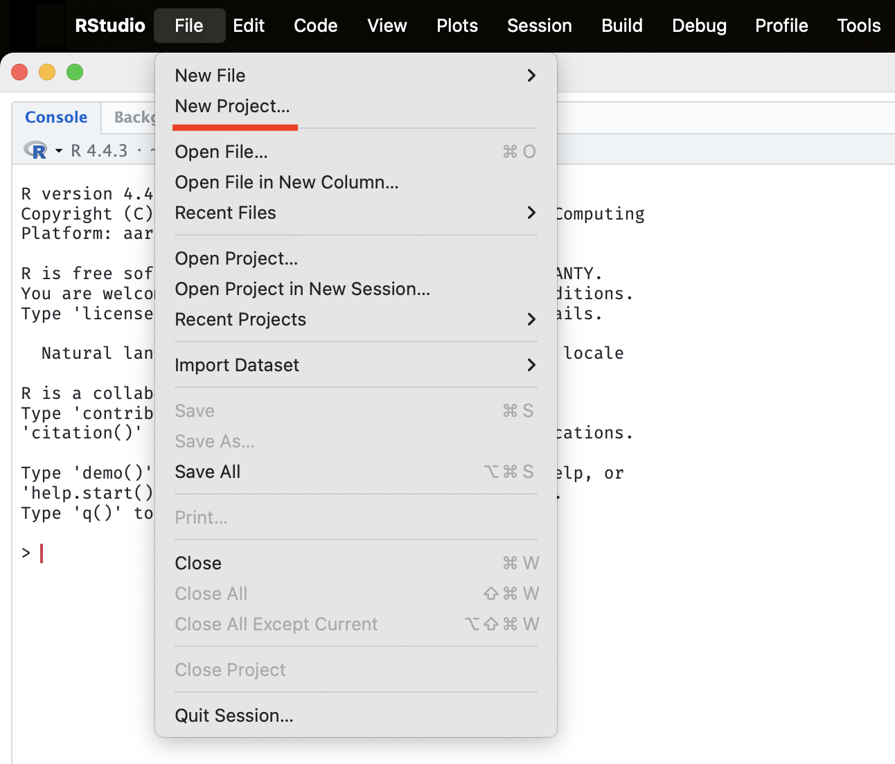
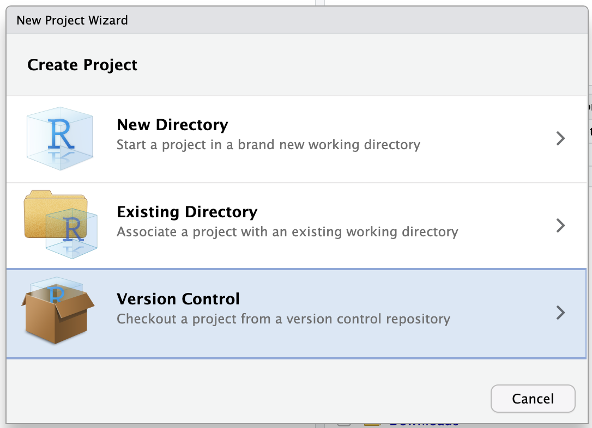
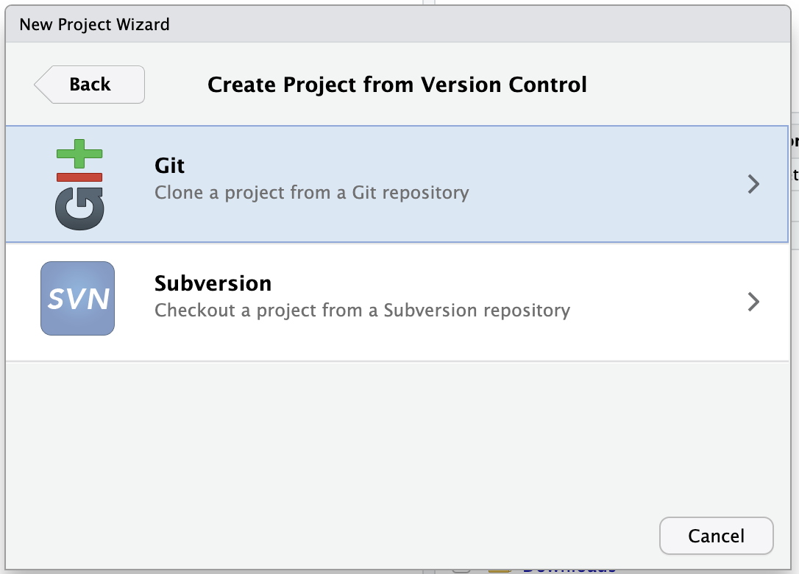
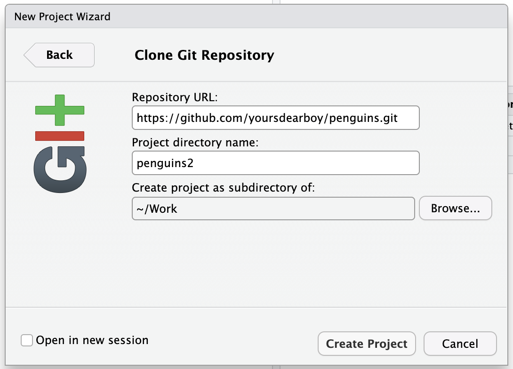
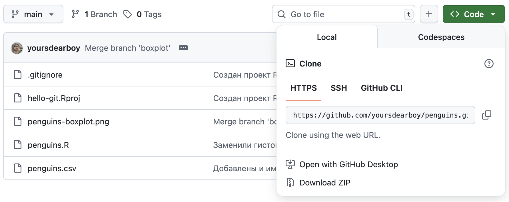

# Клонирование репозитория {#git-clone}

Сейчас ваш репозиторий доступен публично и вы можете поделиться им скопировав ссылку из адресной строки браузера. Отличная идея приложить ее к тексту публикации или например в чате, если вы просите помощи в решении проблемы.

Как человек интересующийся пингвинами, я не могу пройти мимо и хочу загрузить ваш репозиторий себе на компьютер, сделаем это вместе.

Создадим проект RStudio.
В верхнем меню выберите [File → New Project]{.figtext}.
В появившемся окне выберите [Version Control]{.figtext} и далее [Git]{.figtext}.
В поле [Repository URL]{.figtext} вставьте адрес вашего репозитория, который можно скопировать нажав кнопку [Code]{.figtext} на странице репозитория (обратите внимание, чтобы была выбрана опция **HTTPS**). В поле [Project directory name]{.figtext} укажите название папки для проекта, т.к. папка `penguins` у вас уже существует, назовите ее `penguins2`.

<table class="table table-borderless">
    <tr>
        <td>{width="320px"}</td>
        <td>{width="320px"}</td>
    </tr>
    <tr>
        <td>{width="320px"}</td>
        <td>{width="320px"}</td>
    </tr>
    <tr>
        <td>{width="320px"}</td>
        <td></td>
    </tr>
</table>

Теперь у вас есть копия удаленного репозитория на вашем компьютере с которой можно работать как с нашим оригинальным проектом.
