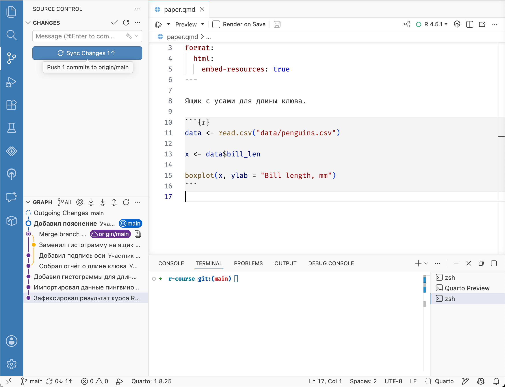
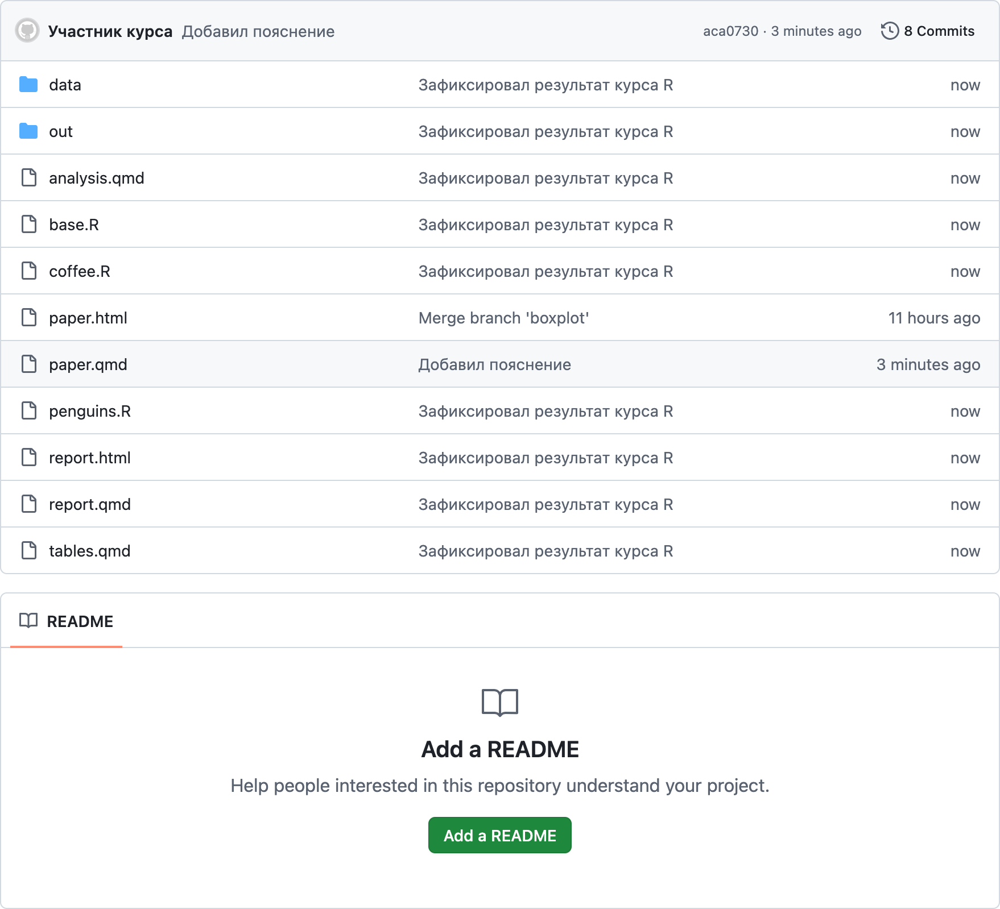
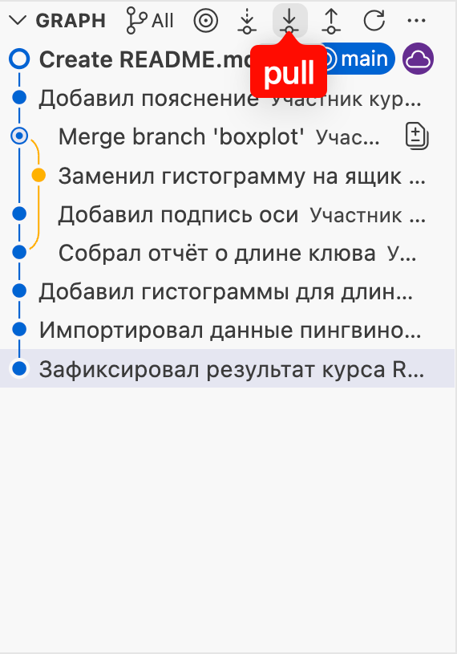

# Загрузка изменений {#git-push-pull}

```{r, include=FALSE}
# Рассмотреть пример ситуации - push с конфликтом (надо сначала сделать pull).
# Для этого надо создать изменения на GitHub,
# потом в репозитории, сделать push и только потом pull.
# Это не последовательно и запутает, оставить для практики.
```

На предыдущем шаге мы загрузили изменения из локального репозитория в удалённый репозиторий на GitHub при помощи команды `git push` в терминале.
Git не синхронизирует изменения автоматически, это необходимо делать вручную.

Создадим и загрузим ещё один коммит. Добавьте в `paper.qmd` перед чанком с графиком короткое пояснение, например:

```
Ящик с усами для длины клюва.
```

Сохраните и закомитьте файл `paper.qmd`.
После чего нажмите кнопку [Sync Changes]{.figtext} на панели [Source Control]{.figtext}.

{width=100%}

Перейдите на страницу репозитория на GitHub и убедитесь, что коммит был загружен.
Это можно понять по тексту сообщения над списком файлов и по тексту и времени изменения напротив файла `paper.qmd`.

{width=100%}

GitHub позволяет вносить изменения в репозиторий из веб-интерфейса.
Эта функция используется редко, потому что код необходимо запускать и проверять на компьютере, но она полезна для небольших правок или загрузки файлов.
Создадим при помощи нее новый файл.
Файл README --- это файл, который отображается на главной странице репозитория для краткого описания проекта. Обычно он включает описание данных и кода, как начать работу с проектом и тому подобное.

Нажмите кнопку [Add a README]{.figtext}. В открывшемся файле введите текст в формате Markdown^[в документе Quarto используется тот же синтаксис разметки, но README не выполняет код на R] (используйте или измените текст ниже)
и нажмите кнопку [Commit changes]{.figtext} в верхнем правом углу.
Откроется окно создания коммита, оставьте текст по умолчанию и подтвердите создание коммита нажатием кнопки [Commit changes]{.figtext}

{width=100%}

```md
# Учебный проект

Этот репозиторий был создан в рамках курса [«Основы Git»](https://yoursdearboy.github.io/git-101/),
чтобы познакомиться с фиксацией изменений, ветвлением и работой с GitHub.

В качестве примера использованы данные о длине клюва 🐧 пингвинов,
собранные доктором Кристен Горман на станции «Палмер» в Антарктиде.

Файлы проекта:

- `paper.html` — готовый отчёт
- `paper.qmd` — документ Quarto с кодом
- `data/penguins.csv` — данные
```

Загрузить изменения из удалённого репозитория можно двумя способами: выполнить команду `git pull` в терминале или нажать кнопку [Pull]{.figtext} справа от заголовка [Graph]{.figtext} на панели [Source Control]{.figtext} в Positron.

::: {style="float: left; clear: both; width: 200px; margin-right: 20px;"}
{width=100%}
:::

Загрузите изменения любым из этих способов.
Если загрузка прошла успешно, в журнале появится коммит созданный через GitHub, а в списке файлов `README.md`.

::: {.clearfix}
:::

Как и в случае с переключением веток, Git откажется загружать изменения и выдаст ошибку, если в рабочей папке имеются незафиксированные изменения, которые конфликтуют с загружаемыми.

Теперь вы умеете загружать изменения в удалённый репозиторий и из него. Рекомендуем делать это регулярно, чтобы синхронизироваться с другими участниками проекта, по крайней мере, в конце рабочего дня или рабочей сессии.
