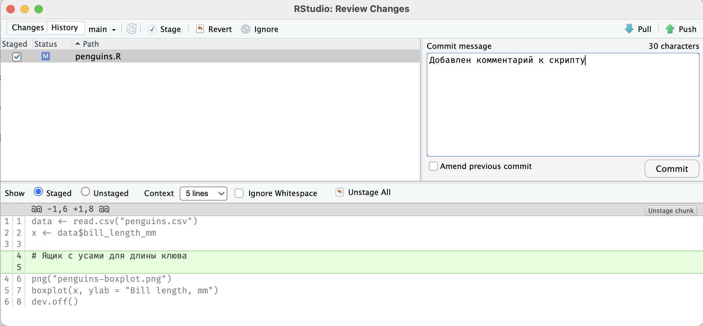
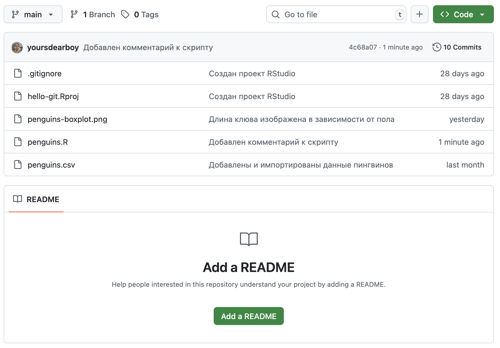

# Загрузка изменений {#git-push-pull}

```{r, include=FALSE}
# Рассмотреть пример ситуации - push с конфликтом (надо сначала сделать pull).
# Для этого надо создать изменения на GitHub,
# потом в репозитории, сделать push и только потом pull.
# Это не последовательно и запутает, оставить для практики.
```

На предыдущем шаге мы загрузили изменения из нашего локального репозитория в удаленный репозиторий на GitHub при помощи команды `push` в терминале.

Git не синхронизирует изменения автоматически, это необходимо делать вручную, используя команду push ил кнопку [Push]{.figtext} в интерфейсе RStudio на панели [Git]{.figtext}.

Создадим и загрузим еще один коммит. Например, добавим небольшой комментарий к коду, чтобы человеку открывшему его впервые было легче разобраться.

```r
data <- read.csv("penguins.csv")
x <- data$bill_length_mm

# Ящик с усами для длины клюва

png("penguins-boxplot.png")
boxplot(x, ylab = "Bill length, mm")
dev.off()
```

Сохраните и закомитьте файл `penguins.R`.
После чего нажмите кнопку [Push]{.figtext} в верхнем правом углу.

{width=100%}

Перейдите на страницу репозитория на GitHub и убедитесь, что коммит был загружен.
Это можно понять по тексту сообщения над списком файлов и по тексту и времени изменения напротив файла `penguins.R`.

{width=100%}

GitHub позволяет вносить изменения в репозиторий из веб-интерфейса.
Эта функция используется редко, потому что код необходимо запускать и проверять на компьютере, но она полезна для небольших правок или загрузки файлов.
Создадим при помощи нее новый файл.
Файл README --- это файл, который отображается на главной странице репозитория для краткого описания проекта. Обычно он включает описание данных и скриптов, как начать работу с проектом и тому подобное.

Нажмите кнопку [Add a README]{.figtext}. В открывшемся файле введите текст в формате Markdown^[это как RMarkdown, только без возможности выполнения кода на R] (используйте или измените текст ниже)
и нажмите кнопку [Commit changes]{.figtext} в верхнем правом углу.
Откроется окно создания коммита, оставьте текст по умолчанию и подтвердите создание коммита нажатием кнопки [Commit changes]{.figtext}

{width=100%}

```md
# Пингвины «Палмер» 🐧

Этот репозиторий был создан в рамках курса от [Института биоинформатики](bioinf.me/education/stat),
чтобы познакомиться с основами Git — фиксацией изменений, ветвлением и работой с GitHub.

В качестве примера использованы данные о длине клюва пингвинов,
собранные доктором Кристен Горман на станции «Палмер» в Антарктиде.

Содержимое репозитория:

- penguins-boxplot.png — диаграмма ящик с усами, показывающая распределение длины клюва
- penguins.R — скрипт для построения диаграммы
- penguins.csv — данные
```

Чтобы загрузить изменения из удаленного репозитория на компьютер используется команда **pull**.

Вернитесь в RStudio и на панели [Git]{.figtext} нажмите кнопку [Pull]{.figtext}.
Если команда выполнилась успешно, в списке файлов появится файл `README.md`,
а в журнале --- коммит созданный через GitHub.

Как и в случае с переключением веток, Git откажется загружать изменения и выдаст ошибку, если в рабочей папке имеются незафиксированные изменения, которые конфликтуют с загружаемыми.

Теперь вы умеете загружать изменения в удалённый репозиторий и из него. Рекомендуем делать это регулярно, чтобы синхронизироваться с другими участниками проекта, по крайней мере, в конце рабочего дня или рабочей сессии.
