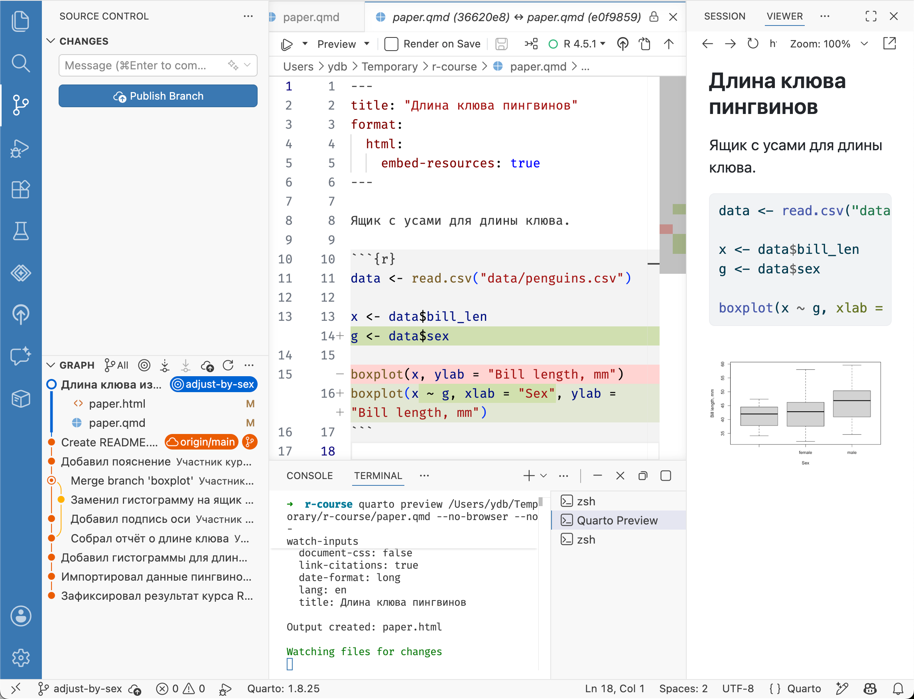
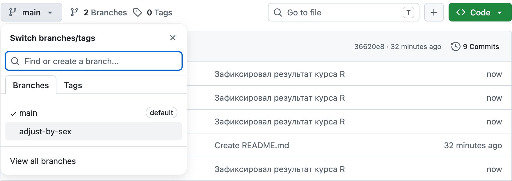
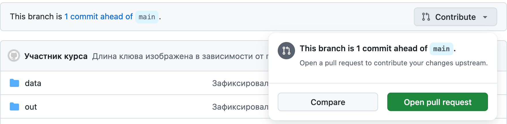
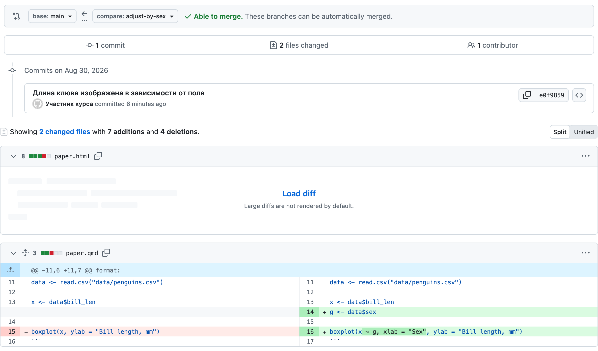
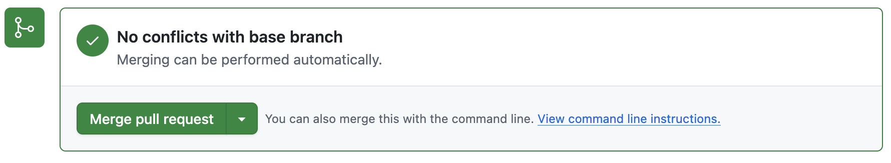
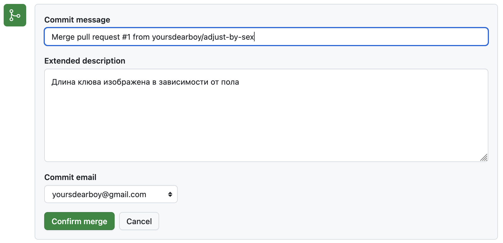
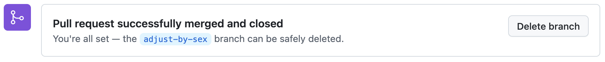

# Pull Request {#pr}

Pull Request --- это механизм GitHub для слияния веток загруженных в удаленный репозиторий, позволяющий просмотреть, обсудить и проверить предлагаемые изменения перед слиянием. Похожий механизм существует и на других платформах.

Орнитолог проходящий мимо нашего репозитория обратит внимание, что длину клюва пингвина лучше рассматривать в зависимости от пола. Он даже может предложить необходимые изменения при помощи Pull Request.

Создайте ветку с названием `adjust-by-sex`, как показано в [разделе «Создание ветки»](#git-branch): нажмите `main`в строке состояния Positron и выберите [Create new branch…]{.figtext} Убедитесь, что вместо `main` выводится название созданной ветки `adjust-by-sex`.

Замените код в чанке на приведённый ниже. Чтобы посмотреть, что изменилось, выберите файл `paper.qmd` на панели [Source Control]{.figtext}.

```{r, eval=FALSE}
data <- read.csv("data/penguins.csv")

x <- data$bill_len
g <- data$sex

boxplot(x ~ g, xlab = "Sex", ylab = "Bill length, mm")
```

Сохраните файл и нажмите [Preview]{.figtext}, чтобы обновить отчёт.
Создайте коммит, включив в него `paper.qmd` и `paper.html`.
После создания коммита выберите [Publish Branch]{.figtext} на панели [Source Control]{.figtext}.

{width=100%}

Так как у вас полные права на редактирование репозитория, то новая ветка будет загружена на GitHub.
Прохожему орнитологу пришлось бы создать свою копию репозитория или просить дать доступ средствами GitHub.

Перейдите на страницу репозитория в GitHub и убедитесь, что ветка содержит сделанные измнения, для этого выберите ее в выпадающем меню появляющемся при нажатии кнопки с названием ветки [main]{.figtext}.

{width=100%}

При просмотре ветки отличной от основной, GitHub предложит создать из нее **Pull Request** --- предложение автору репозитория слить изменения из этой ветки. Нажмите кнопку [Contribute]{.figtext} и в выпадающем меню выберите [Open pull request]{.figtext}.

{width=100%}

GitHub предложит ввести заголовок и описание предлагаемых изменений, правило хорошего тона кратко описать причину изменений и суть предлагаемого решения. А также, прокрутите страницу создания Pull Request и проверьте изменения, которые вы предлагаете, после чего нажмите кнопку [Create pull Request]{.figtext} под полем с описанием.

{width=100%}

На странице Pull Request владельцу репозитория доступна опция слить предложенные изменения.
Нажмите кнопку [Merge pull request]{.figtext} внизу страницы.
В открывшемся окне GitHub предложить ввести текст коммита, как если бы мы делали слияние ветки в Positron. Оставьте или измените текст и нажмите кнопку [Confirm merge]{.figtext}
После успешного слияния ветку можно удалить.

{width=100%}
{width=100%}
{width=100%}

Вернёмся к проекту в Positron. Мы выполнили слияние на GitHub, поэтому локальный репозиторий ещё не содержит новых изменений.
Переключитесь на `main` при помощи строки состояния и загрузите изменения, как в [предыдущей главе](#git-push-pull), нажав [Pull]{.figtext}.
Убедитесь, что файлы `paper.qmd` и `paper.html` обновились.
