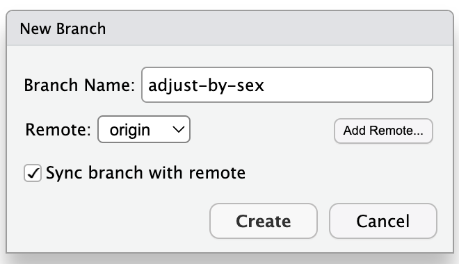
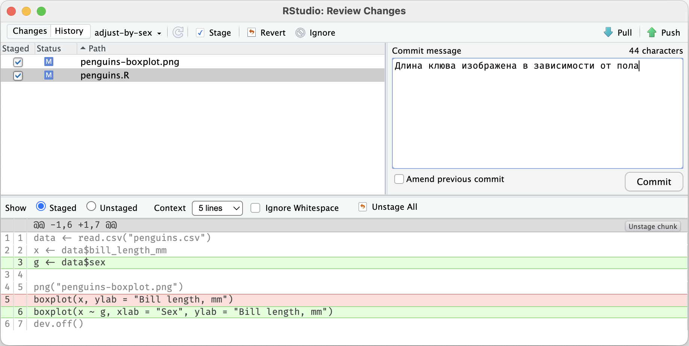
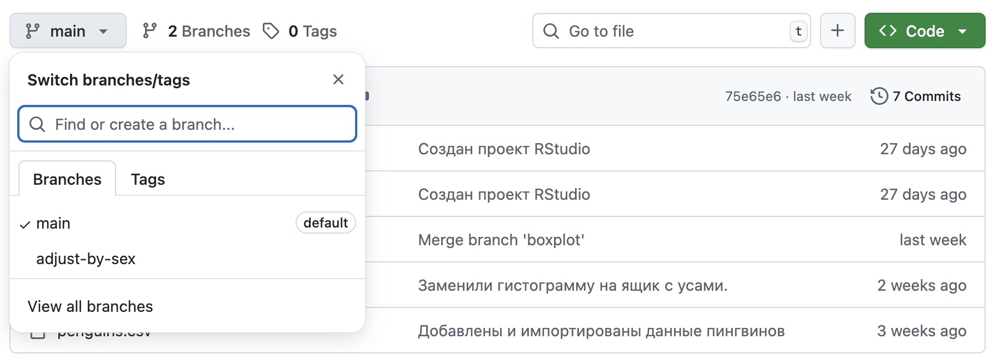
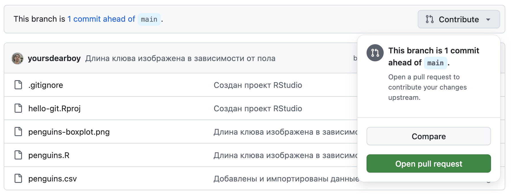
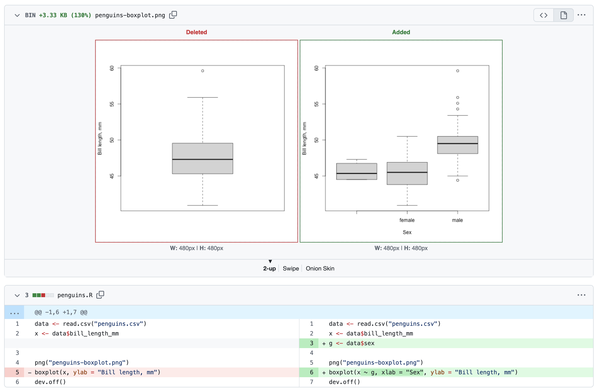

# Pull Request {#pr}

Pull Request --- это механизм GitHub для слияния веток, загруженных в удаленный репозиторий, который позволяет просмотреть, обсудить и проверить предлагаемые изменения перед их слиянием. Похожий механизм существует и на других платформах.

Орнитолог, проходящий мимо нашего репозитория, обратит внимание на то, что длину клюва пингвина лучше рассматривать в зависимости от пола. Он даже может предложить необходимые изменения при помощи Pull Request.

Создайте ветку с названием `adjust-by-sex` при помощи кнопки [New branch]{.figtext} на панели [Git]{.figtext} в RStudio. Убедитесь, что справа от кнопки вместо названия ветки по умолчанию `main` выводится название созданной ветки `adjust-by-sex`.

{width=200}

Отредактируйте скрипт `penguins.R`, добавив пол в код для построения ящика с усами. Код приведен ниже. Не забывайте, что вы можете сравнить изменения по с оригиналом при помощи кнопки [Diff]{.figtext} на панели [Git]{.figtext}.

```r
data <- read.csv("penguins.csv")
x <- data$bill_length_mm
g <- data$sex

png("penguins-boxplot.png")
boxplot(x ~ g, xlab = "Sex", ylab = "Bill length, mm")
dev.off()
```

Сохраните и выполните скрипт `penguins.R`.
Создайте коммит, включив в него скрипт и обновленную диаграмму `penguins-boxplot.png`.

{width=100%}

После создания коммита нажмите кнопку [Push]{.figtext} в верхнем правом углу на панели [Git]{.figtext}. Так как у вас полные права на редактирование репозитория, то новая ветка будет загружена на GitHub. Прохожему орнитологу пришлось бы создать свою копию репозитория или попросить дать доступ к редактированию вашего репозитория средствами GitHub.

Перейдите на страницу репозитория в GitHub и убедитесь, что ветка была загружена и содержит сделанные измнения. Для этого выберите ее в выпадающем меню, появляющемся при нажатии кнопки с названием ветки [main]{.figtext}.

{width=100%}

При просмотре ветки, отличной от основной, GitHub предложит создать из нее **Pull Request** --- предложение автору репозитория слить изменения из этой ветки. Нажмите кнопку [Contribute]{.figtext} и в выпадающем меню выберите [Open pull request]{.figtext}.

{width=100%}

GitHub предложит ввести заголовок и описание предлагаемых изменений. По правилом хорошего тона, необходимо кратко описать причину изменений и суть предлагаемого решения. Прокрутите страницу создания Pull Request и проверьте изменения, которые вы предлагаете. После этого нажмите кнопку [Create pull Request]{.figtext} под полем с описанием.

{width=100%}

На странице Pull Request владельцу репозитория будет доступна опция слить предложенные изменения.
В данном случае владельцем репозитория являетесь вы сами. 
Нажмите кнопку [Merge pull request]{.figtext} внизу страницы.
В открывшемся окне GitHub предложит ввести текст коммита, как если бы мы делали слияние ветки в терминале. 
Оставьте или измените текст и нажмите кнопку [Confirm merge]{.figtext}
После успешного слияния ветку можно удалить.

{width=100%}
{width=100%}
{width=100%}

Вернемся к нашему проекту в RStudio.
Слияние было выполнено онлайн на GitHub, а значит, необходимо загрузить изменения в наш локальный репозиторий, т.е. сделать pull.
Переключитесь на ветку `main` при помощи панели [Git]{.figtext} и нажмите кнопку [Pull]{.figtext}.
Убедитесь, что теперь ветка `main` содержит актуальные изменения в файлах `penguins.R` и `penguins-boxplot.png`.
