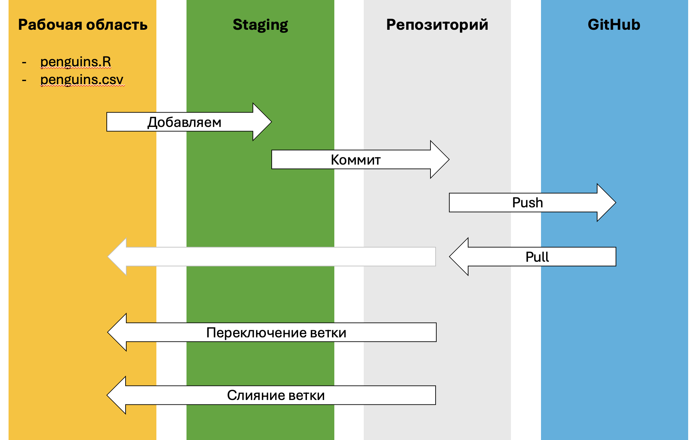

# Заключение

Теперь у вас есть аккаунт на GitHub и вы умеете синхронизировать изменения с удаленным репозиторием,
пользоваться веб-интерфейсом и создавать Pull Request.
Этого достаточно для командной работы на курсе и в большинстве проектов.

Диаграмма ниже поможет запомнить как соотносятся действия, которые мы изучили:
[1) создание коммитов](#git-commit), [2) работа с ветками](#branch) и [3) синхронизация с удаленным репозиторием](#git-push-pull).

{width=100%}

Рекомендуем использовать Git в своих проектах и не бояться экспериментировать с ветками.
Это помогает структурировать рабочий процесс, делает анализ данных воспроизводимым и облегчает командную работу.
Даже если вы работаете в одиночку, история изменений, возможность вернуться к предыдущим версиям и ветвление значительно упрощают развитие проекта.
А со временем вы сможете применять более продвинутые возможности, такие как автоматизация, интеграция с другими сервисами и управление проектами.

Удачи в прохождении курса!
