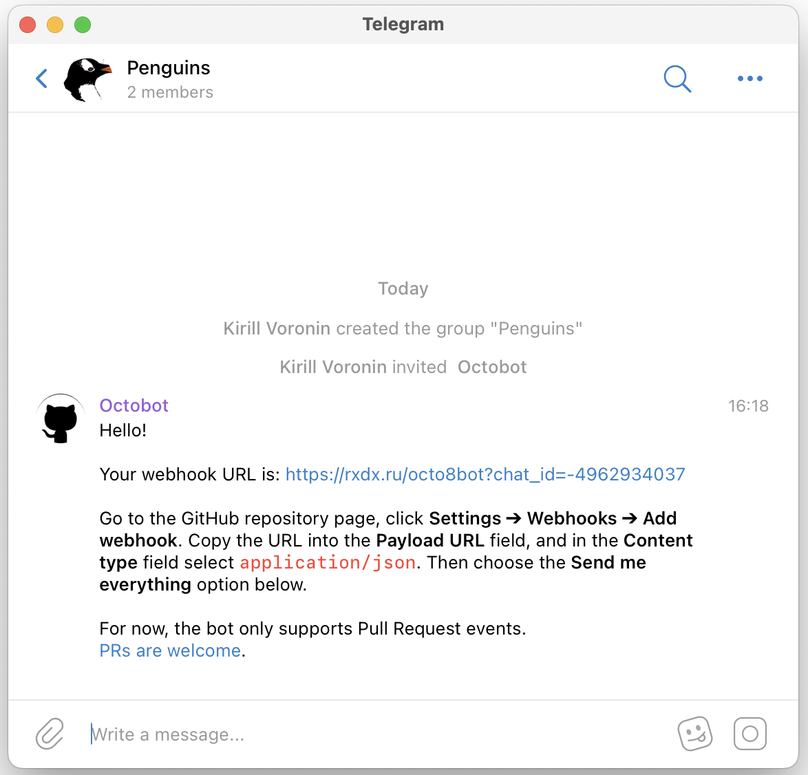
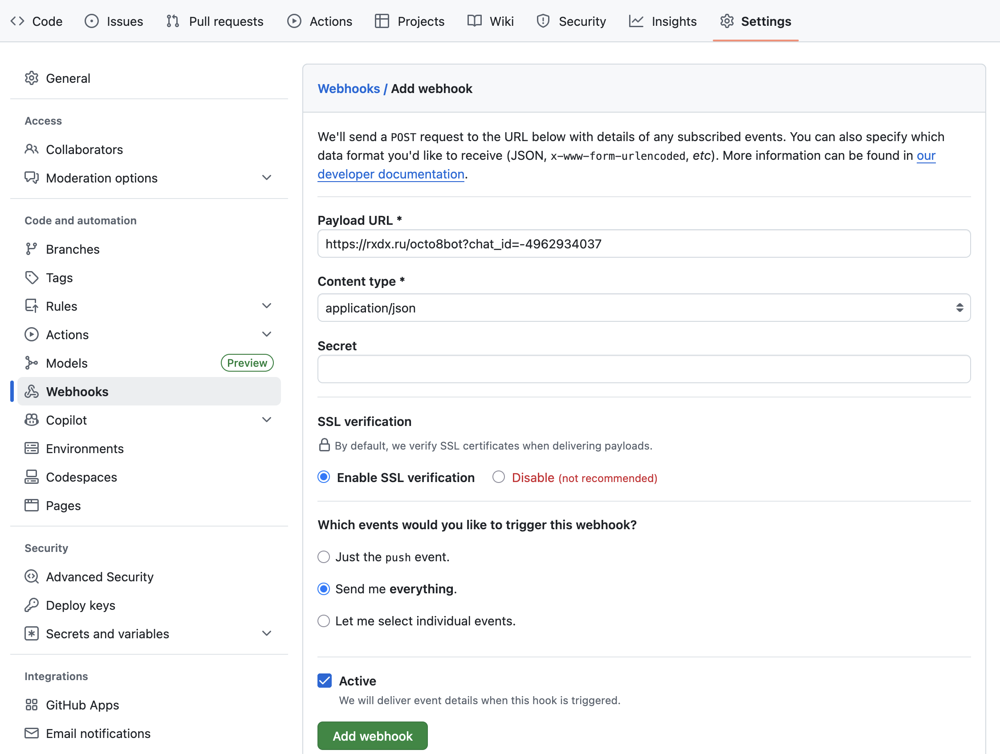
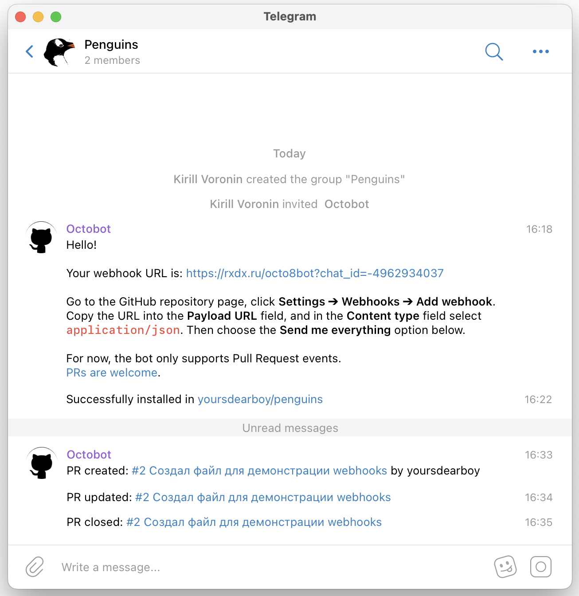

# Webhooks {#webhooks}

Webhooks — это механизм GitHub для реагирования на события в репозитории.
Когда что-то происходит (например, кто-то сделал push или создал Pull Request),
GitHub отправит информацию о событии на указанный в настройках адрес.

Для обработки событий по указанному адресу должна работать программа (веб-сервер).
Многие сервисы, например Slack или Microsoft Teams, поддерживают таким образом отправку уведомлений в рабочий чат.
Для Telegram можно воспользоваться ботом [\@octo8bot](https://t.me/octo8bot).

Добавьте бота в чат и скопируйте присланный им адрес.

{width=400px}

Откройте репозиторий на Github и выберите **Settings → Webhooks → Add webhook**.
Вставьте адрес в поле **Payload URL** и заполните форму как на скриншоте ниже.
Нажмите **Add webhook**.

{width=100%}

Если webhook настроен правильно, в чат придет сообщение с текстом «Successfully installed».

Когда создаётся новый Pull Request, в него вносятся изменения или он сливается (merge), бот пришлет уведомление с ссылкой на этот Pull Request.

{width=400px}
