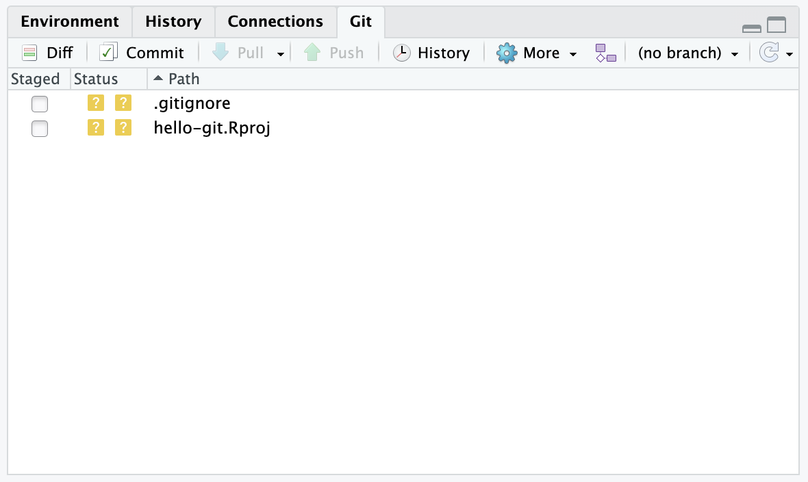
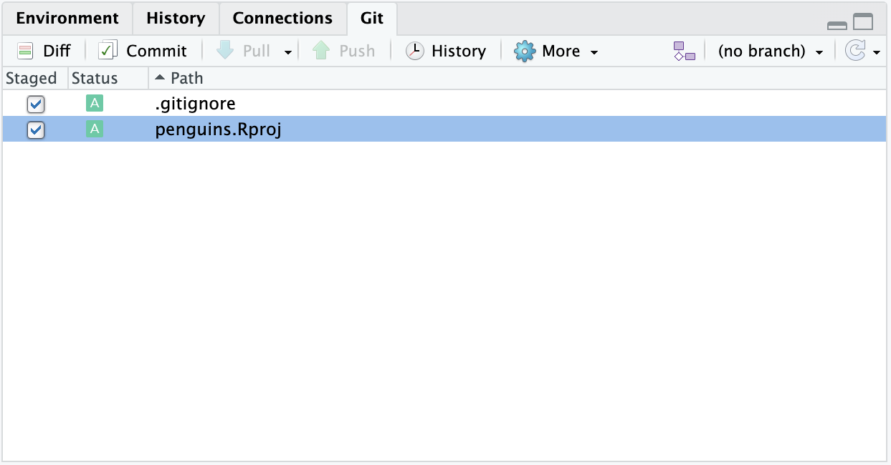
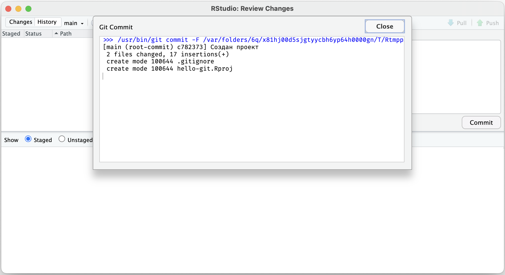
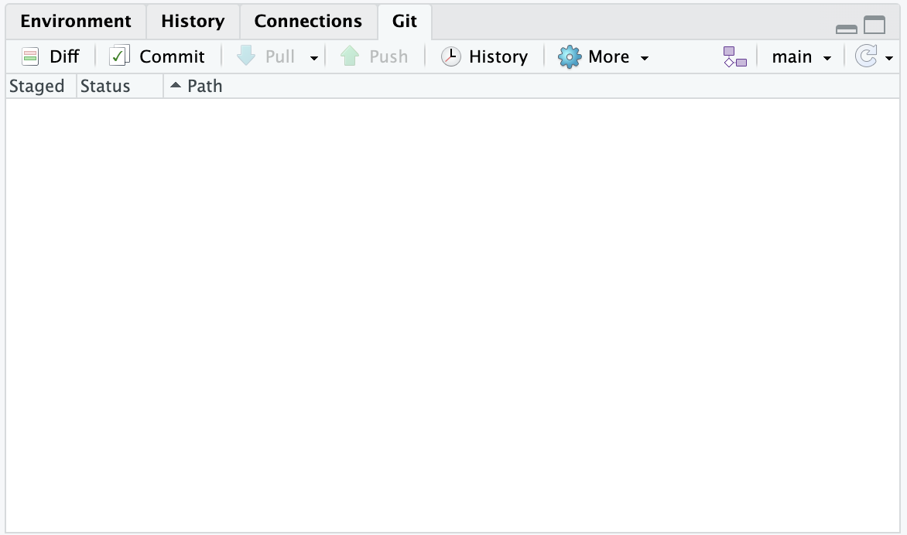
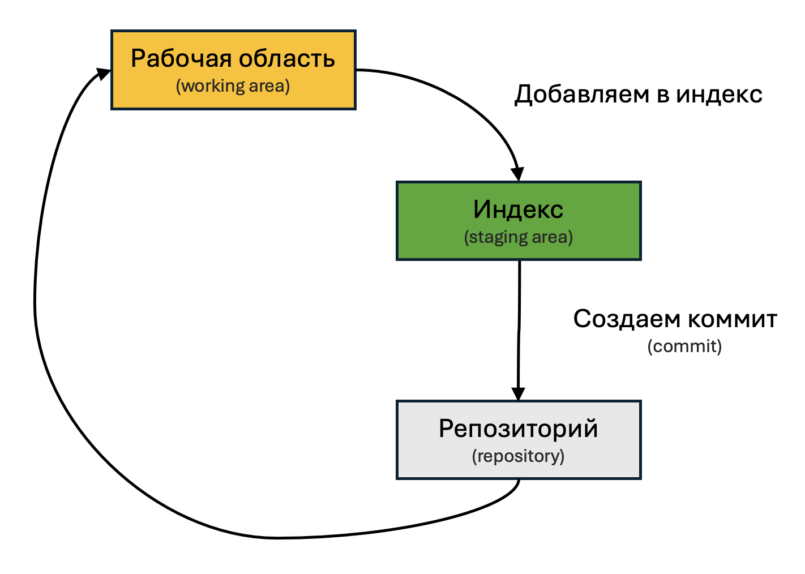

# Отслеживание изменений {#git-commit}

Git отслеживает изменения в файлах, находящихся внутри репозитория.
Но не все подряд, как скажем, это делает блокнот или Word (при помощи команды «Отменить», Ctrl+Z),
а только то, что поменялось с последней версии.
Поэтому периодически необходимо фиксировать изменения в версии --- так называемые **«коммиты» (commit)**.

Для работы с Git в RStudio предусмотрена панель с соответствующим названием [Git]{.figtext} (по умолчанию находится в верхнем правом углу).

Нет панели Git?

Значит, вы не отметили галочку [Create a git repository]{.figtext} [при создании проекта](#git-init) или [не установили Git](#install).
Исправьте ошибку и создайте проект заново.

{width=400px}

В отличие от списка файлов на этой панели выводятся только те файлы, которые были изменены с последнего коммита (версии).
Так как мы еще не создали ни одной версии, то в списке выведены оба файла, созданных с проектом: `.gitignore` и `hello-git.Rproj`

Для создания коммита (версии) необходимо отметить изменения, которые вы хотите зафиксировать, проверить их, снабдить небольшим описанием и зафиксировать.

Итак, отметьте файлы галочкой в столбце [Staged]{.figtext} на панели [Git]{.figtext} [(A)]{.figref}.
Обратите внимание на название столбца (staged) --- мы поместили отмеченные файлы в так называемую **промежуточную область (staging)**, и только они будут зафиксированы, остальные файлы останутся в папке, но не будут добавлены в коммит (версию).
Нажмите кнопку **Commit** [(B)]{.figref}.

{width=400px}

В открывшемся окне можно подробнее ознакомиться с фиксируемыми изменениями.
Введите краткое описание в поле [Commit message]{.figtext}, которое характеризует сделанные изменения
[(C)]{.figref}.
В нашем случае был создан проект --- это и будет хорошим описанием внесенных изменений.

{width=600px}

Нажмите кнопку [Commit]{.figtext} [(D)]{.figref}.
В появившемся окне не должно быть ошибок, но должно быть сообщение, как на изображении.

{width=600px}

Можно закрыть оба окна и вернуться к RStudio.
Обратите внимание, теперь панель [Git]{.figtext} со списком измененных файлов пуста --- у нас нет изменений относительно последней версии, которую мы только что создали.

{width=400px}

Итак, мы добавили файлы в **промежуточную область (staging)** и создали из них первый **коммит (версию)** нашего проекта. И теперь имеем версию, к которой всегда можно вернуться и начать работу с этого места. Процесс работы с Git схематично выглядит следующим образом.

{width=350px}

---

**Вопрос 1. Что такое «коммит»?**

- Так называются все файлы в папке
- Промежуточное хранилище для файлов
- Зафиксированная версия проекта, к которой можно вернуться в любой момент
- Список измененных файлов

**Вопрос 2. Что необходимо сделать, чтобы изменения файлов попали в коммит в RStudio?**

- Достаточно просто сохранить файлы
- Отметить измененные файлы галочкой в столбце Staged
- Ввести описание в поле Commit message и нажать Commit
- Сохранить файлы и перезапустить RStudio

**Вопрос 3. Сколько файлов вы видите на панели Git в RStudio?**

*(Для проверки, что все идет по плану.)*

- Ни одного
- Два файла
- Три или четыре файла
- Гораздо больше

---

*(Выбрать один термин - коммит или версия, а не указывать в скобках?)*
