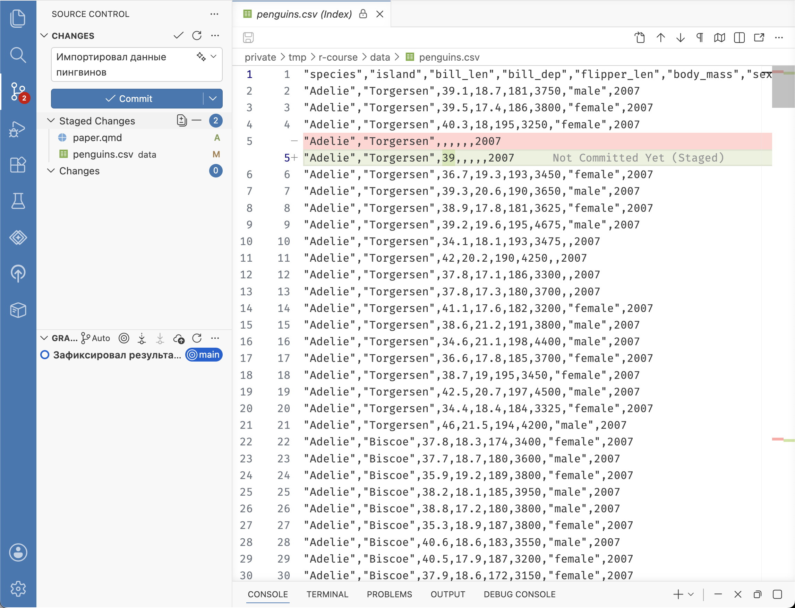
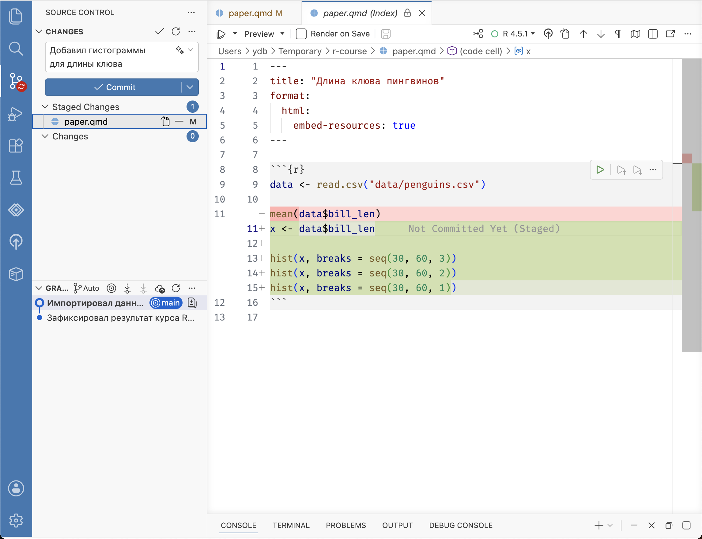
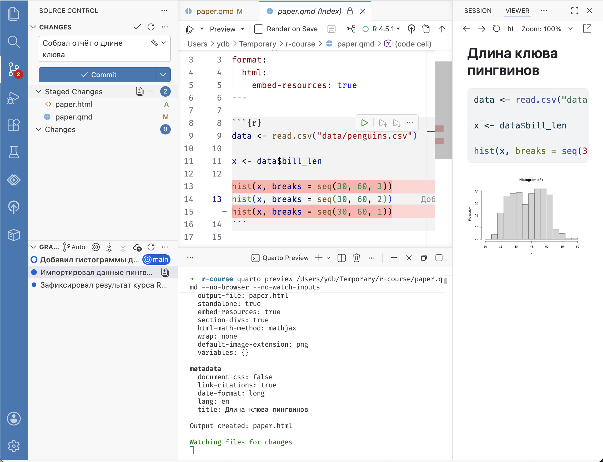

# Рабочий процесс {#git-commit2}

В предыдущей главе мы научились создавать коммиты (версии).
Работая с Git, это нужно делать регулярно ---
обычно после выполнения задачи или её части,
после внесения исправлений или просто чтобы зафиксировать изменения.
Коммит сохраняет «стабильную» версию проекта, к которой можно вернуться или сравнить с ней сделанные изменения.

Рассмотрим процесс работы над проектом подробнее:

1. Мы создали коммит, и с тех пор в рабочей папке не было изменений.
2. Выполняем задачу и добавляем нужные для ее решения изменения в индекс, а лишние, например код для отладки или временные файлы, удаляем.
3. Перед созданием коммита обязательно проверяем изменения, которые в него попадут.
   Начинающие пользователи часто либо добавляют ненужный код, не относящийся к задаче, либо забывают добавить код, без которого не будет работать остальная часть проекта.
4. Создаём коммит и получаем чистую рабочую папку --- без изменений относительно нового коммита.
   Можно переходить к следующей задаче.

{width=540px}

Такой процесс помогает упорядочить внесение изменений и сделать результат воспроизводимым.
Он хорошо подходит для анализа данных, потому что его легко разделить на задачи, из которых получатся коммиты.
Попробуем сделать это на практике и проанализируем длину клюва антарктических пингвинов.
Каждая подглава этой главы соответствует одной задаче и завершается одним коммитом.

## Импорт данных


Создайте документ Quarto для анализа и сохраните его под названием `paper.qmd` в корне проекта. Вспомнить как это делается можно в [курсе](https://stepik.org/lesson/2482460/step/2?unit=2520222).
Замените содержимое документа кодом ниже и сохраните файл.


```` markdown
---
title: "Длина клюва пингвинов"
format:
  html:
    embed-resources: true
---

```{r}
data <- read.csv("data/penguins.csv")

mean(data$bill_len)
```
````

Выполните чанк.
Функция `mean()` вернёт `NA`, потому что в данных нет двух значений длины клюва.
Пока вы проходили предыдущий курс, мы поймали этих двух пингвинов и измерили их клювы.
Скачайте [обновлённые данные](https://raw.githubusercontent.com/yoursdearboy/git-101/tutorial/course-project/updates/penguins.csv) и замените ими файл `data/penguins.csv`. Снова выполните чанк и убедитесь, что средняя длина клюва равна `43.91802`.

На панели [Source Control]{.figtext} появятся два изменения: новый документ `paper.qmd` и обновлённый файл `penguins.csv`.
Выберите его и проверьте, чем новая версия отличается от прежней:
строки из старого файла выделяются красным цветом, а из нового зеленым.

Добавьте в индекс и документ `paper.qmd`, и обновлённый файл `penguins.csv`: без данных результат анализа нельзя будет воспроизвести.
Выберите файл `paper.qmd` и проверьте содержимое: если он пустой, вы забыли сохранить файл, а Git работает только с сохраненными изменениями.
Создайте коммит с описанием «Импортировал данные пингвинов».

{width=100%}

После создания коммита список изменённых файлов на панели [Source Control]{.figtext} снова должен быть пуст.

## Визуализация

Анализ новых данных полезно начинать с исследования распределения.
Для этого присвоим данные с длиной клюва переменной и построим несколько вариантов гистограммы с разной шириной столбца.
Замените код чанка на приведённый ниже, запустите и посмотрите графики.


``` r
data <- read.csv("data/penguins.csv")

x <- data$bill_len

hist(x, breaks = seq(30, 60, 3))
hist(x, breaks = seq(30, 60, 2))
hist(x, breaks = seq(30, 60, 1))
```

Сохраните файл `paper.qmd` и он опять появится в списке изменений на панели [Source Control]{.figtext}.
Выберите его и проверье изменения: красным - старые строки, зеленым — новые.
Такой формат записи изменений называется **«дифф» (diff)**.  

Обратите внимание, что по умолчанию Git сравнивает строки, а не отдельные слова или символы.
Несмотря на то, что мы заменили `mean()` на присвоение `x <- ` в 11-й строке, Git показывает прежнюю строку как удалённую, а новую — как добавленную. Номера слева указывают положение этих строк в старой и новой версиях файла.

{width=100%}

Добавьте `paper.qmd` в индекс, введите описание «Добавил гистограммы для длины клюва» и нажмите [Commit]{.figtext}.
После создания коммита список изменённых файлов снова должен быть пуст.

## Экспорт

Гистограмма с шириной столбца 2 выглядит наиболее информативно.
Соберём HTML-отчёт, чтобы поделиться с коллегами.

Оставьте в коде чанка только один вариант гистограммы и сохраните файл.


``` r
data <- read.csv("data/penguins.csv")

x <- data$bill_len

hist(x, breaks = seq(30, 60, 2))
```

Нажмите [Preview]{.figtext} вверху окна редактора.
В корне проекта появится файл `paper.html`.
Его мы тоже добавим в коммит.
Во-первых, так другие участники, загрузив проект, сразу увидят результат без необходимости выполнять код.
Во-вторых, если вы измените ширину столбца или другие настройки графика, будет удобно сравнить старую и новую версии.

{width=100%}

Добавьте оба файла в индекс и создайте коммит с описанием «Собрал отчёт о длине клюва».
Проверьте, что на панели [Source Control]{.figtext} не осталось «незакомиченных» изменений.

На этом остановимся и далее посмотрим историю версий в журнале Git.
А пока несколько советов.

::: {.callout .callout-info}
Делайте коммиты часто и не придавайте слишком большое значение планированию.
Коммит это не концептуально новая версия проекта, а просто шаг или изменения, которые вы хотите зафиксировать.


:::

::: {.callout .callout-info}
Не обязательно добавлять в коммит все изменения сразу или их отменять --- они могут оставаться в рабочей папке сколько угодно.
Тем не менее старайтесь не копить изменения, потому что тогда версия в репозитории будет отличаться от версии, с которой вы работаете, а значит, теряется смысл системы контроля версий и возникают ошибки.


:::


