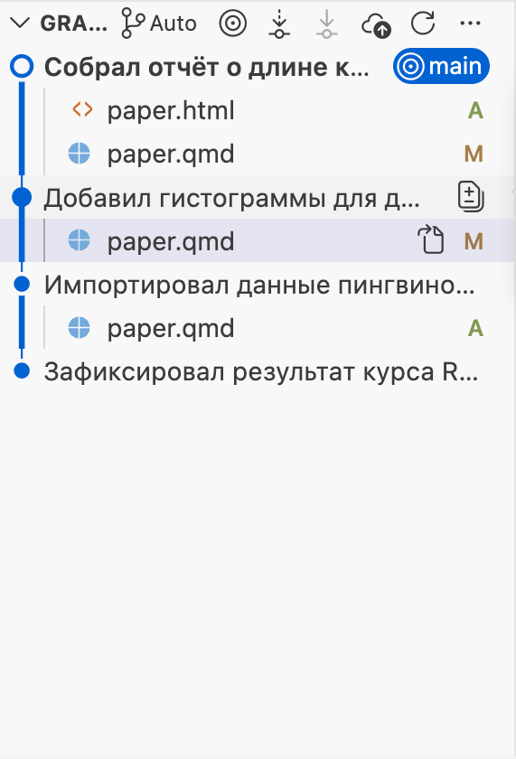
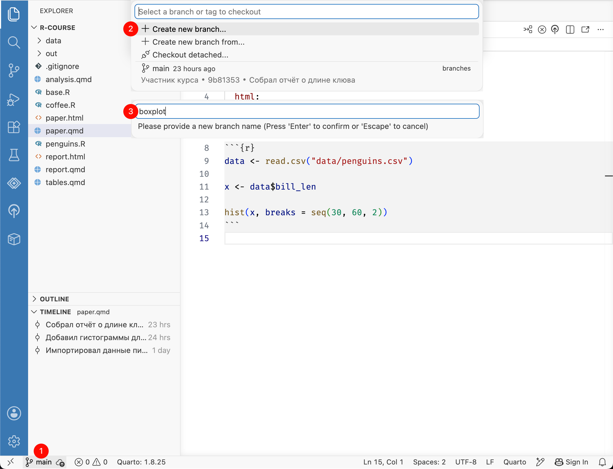
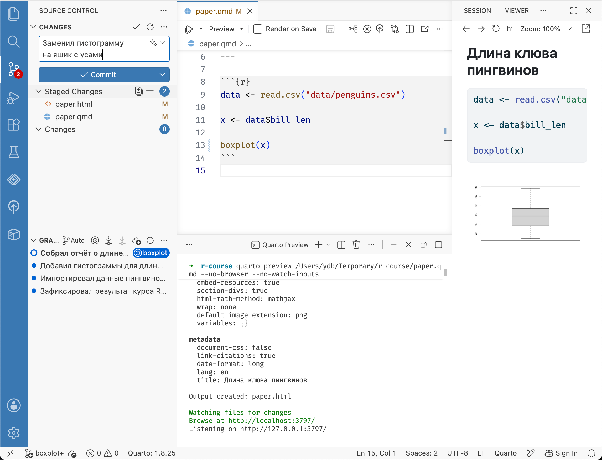

# (PART) Ветки {-}


# Введение {#branch}

До этого мы создавали версии только последовательно,
чтобы записывать историю изменений.
Git позволяет создавать параллельные версии.
Это могут быть как версии различных участников (collaborators) с различных устройств,
так и несколько альтернативных версий на одном и том же компьютере.
Таким образом участники могут создавать и обмениваться различными вариантами изменений.
Git позволяет эффективно объединять эти изменения, делая совместную работу комфортной,
чего, к слову, не умеют облачные сервисы вроде Google Drive.

Для этого используются так называемые ветки (branch).
Почему ветки? Потому что начиная с выбранного коммита история изменений разветвляется.


::: {style="float: left; clear: both; width: 200px; margin-right: 20px;"}
{width=100%}
:::

По умолчанию, мы работаем в ветке `main`
(ранее ветка по умолчанию называлась `master`, будьте готовы встретить и такое название).
Ее можно сравнить со стволом дерева --- вот он слева на изображении.
В нашем проекте с пингвинами в ветке `main` 4 коммита и от любого из них можно начать новую ветку.

Представим ситуацию --- из журнала приходит ответ Рецензента 2, в котором он просит заменить гистограмму на ящик с усами.
С одной стороны, можно податься в журнал, где знают, что такое гистограмма,
с другой, можно хотя бы попробовать удовлетворить пожелания рецензента и,
если нам не понравится новая диаграмма, просто удалить ветку с изменениями.

# Создание ветки {#git-branch}

Чтобы спокойно поэкспериментировать создадим новую ветку.
Так будет проще удалить изменения и они не будут мешать, если мы захотим поправить что-то действительно важное в основной ветке `main`.

В Positron нажмите название текущей ветки `main` в строке состояния внизу окна и выберите [Create new branch…]{.figtext}.
В появившемся поле введите название, например `boxplot`, и нажмите Enter.
Positron переключится на новую ветку `boxplot`.
Обратите внимание, что название ветки в строке состояния поменялось с `main` на `boxplot`.

{width=100%}

Вернемся к пингвинам.
Замените вызов `hist()` в чанке на вызов `boxplot()`:


``` r
data <- read.csv("data/penguins.csv")

x <- data$bill_len

boxplot(x)
```

Сохраните файл и нажмите [Preview]{.figtext}, чтобы обновить отчёт `paper.html`.
Не переживайте, благодаря Git в основной ветке `main` останется прежний вариант с гистограммой.

Отметьте все изменения для фиксации и создайте коммит с описанием «Заменил гистограмму на ящик с усами».
Обратите внимание, что в коммит должны попасть и исходный документ `paper.qmd`, и обновлённый отчёт `paper.html`.

{width=100%}

Теперь отложим эксперименты и вернемся к прежней версии.
