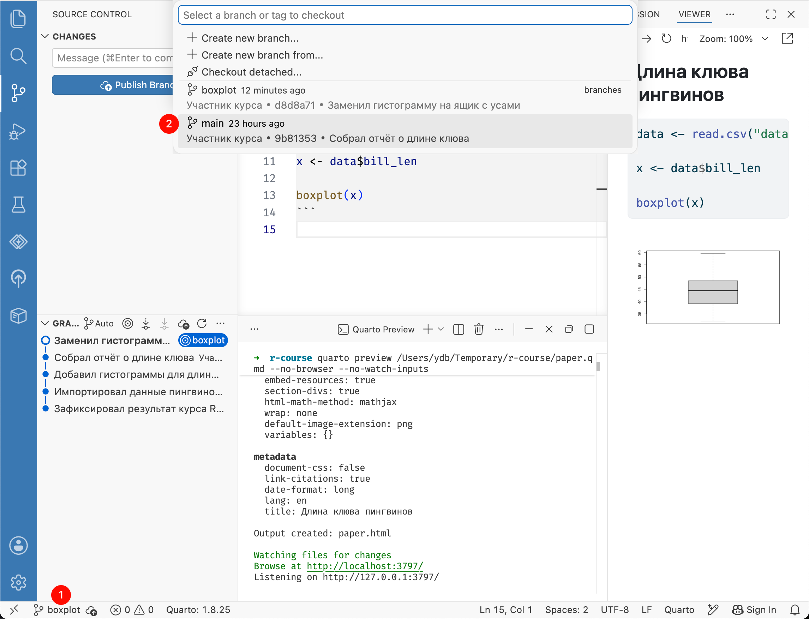
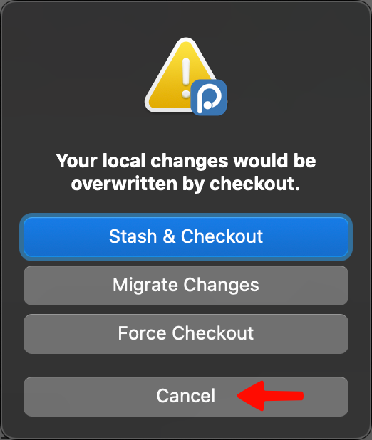
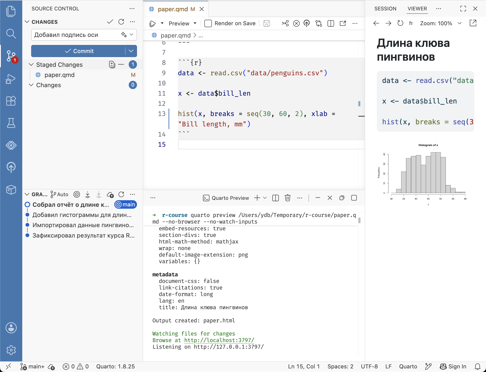

# Переключение веток {#git-checkout}

Для переключения ветки нажмите на название текущей ветки в строке состояния Positron.
В выпадающем списке выберите ветку на которую хотите переключиться (`main`).

{width=100%}

Убедитесь, что код документа `paper.qmd` вернулся к прежнему состоянию и вызывает функцию `hist()`,
а отчёт в окне просмотра строит гистограмму вместо ящика с усами.

Это было просто.
Но есть один случай, когда
Git откажется переключать ветку --- если это приведет к потере данных.

Например, замените код чанка на следующий (добавилась подпись оси X):


``` r
data <- read.csv("data/penguins.csv")

x <- data$bill_len

hist(x, breaks = seq(30, 60, 2), xlab = "Bill length, mm")
```

::: {style="float: left; clear: both; width: 200px; margin-right: 20px;"}
{width=100%}
:::

Сохраните файл и попробуйте переключиться на ветку `boxplot`.
Вы увидите сообщение, как на скриншоте слева.
Если бы Git переключил ветку, ему бы пришлось перезаписать файл `paper.qmd`, в который мы внесли изменения, но не зафиксировали.
Positron предлагает временно спрятать изменения (**Stash**), чтобы можно было переключиться.
Но есть решение лучше — зафиксировать их создав коммит.
Нажмите **Cancel**, чтобы отменить переключение.
Добавьте изменения в индекс и создайте коммит с описанием «Добавил подпись оси».

{width=100%}

Попробуйте снова переключиться на ветку `boxplot`.
На этот раз переключение должно пройти без ошибок (убедитесь, что код в редакторе изменился).
