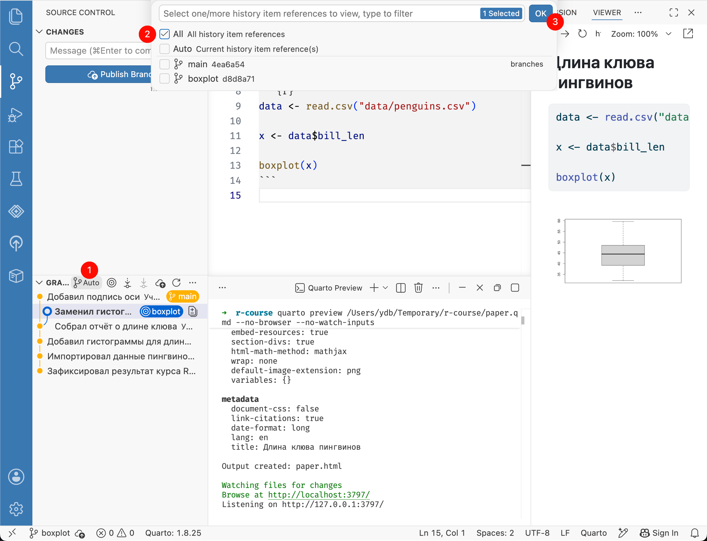
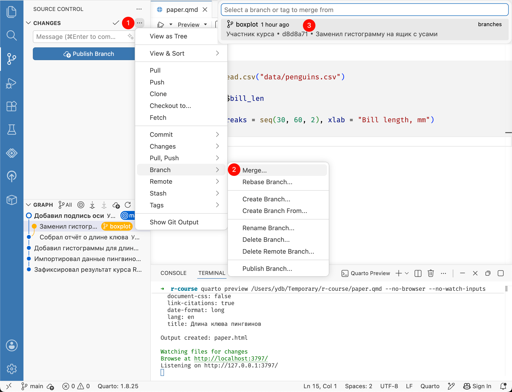
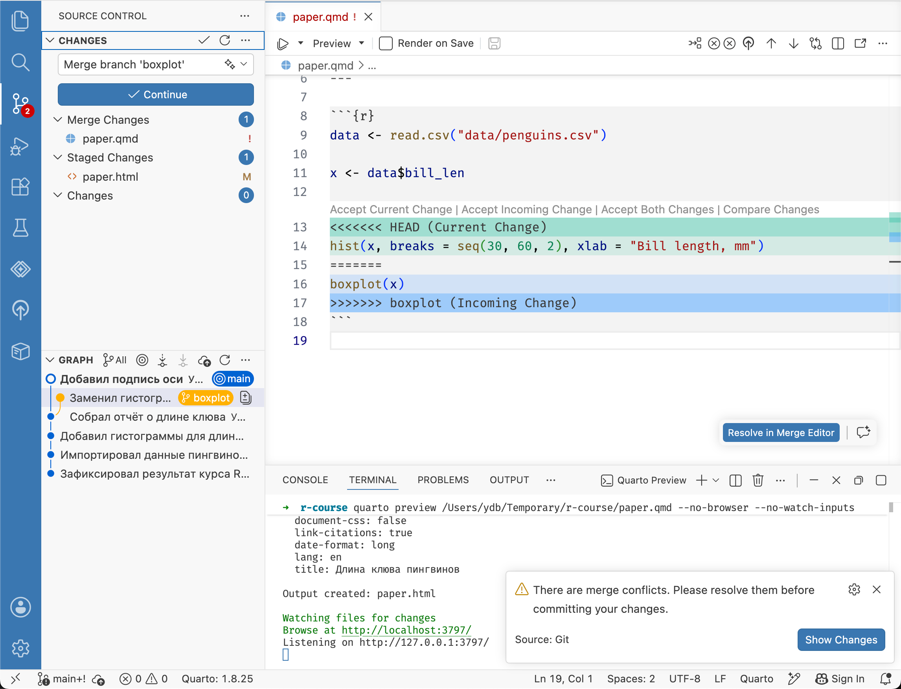
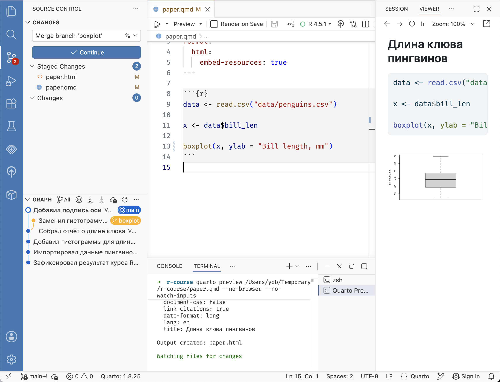

# Слияние веток {#git-merge}

На панели [Source Control]{.figtext} разверните раздел [Graph]{.figtext} внизу, как показано в главе
[просмотр истории](#git-log).
Справа от заголовка [Graph]{.figtext} нажмите [Auto]{.figtext} с иконкой ветки
и в выпадающем меню выберите [All]{.figtext}.
Диаграмма покажет обе ветки, и теперь должно быть ясно, почему они так называются.

{width=100%}

Если мы или другой участник проекта решим принять эти изменения в основную ветку `main`,
нам нужно выполнить операцию **«слияния» (merge)**.

Для начала переключитесь на ветку, в которую будут вливаться изменения ---
в нашем случае это `main` ([см. переключение веток](#git-checkout)).
На панели [Source Control]{.figtext} нажмите кнопку с троеточием справа от заголовка [Changes]{.figtext}. Выберите [Branch → Merge…]{.figtext}, а затем --- ветку `boxplot`.

{width=100%}

Git попытается автоматически объединить изменения из обеих веток и создать новый коммит.
В большинстве случаев этого достаточно,
но любая совместная работа может приводить к конфликтам ---
когда в обеих ветках была изменена одна и та же строка, но разным образом.
Какую версию предпочтет Git?
Git предпочтет выдать ошибку и попросит вас разрешить конфликт.

В списке изменений мы видим,
что Git автоматически добавил в индекс отчёт `paper.html` из ветки `boxplot`,
но не документ `paper.qmd`, который отмечен восклицательным знаком.

Причина в том, что после изменения кода графика в ветке `boxplot`
мы изменили ту же строку в ветке `main`.
Откройте файл `paper.qmd`.
Git сохранил в нём обе версии кода и разделил их специальными маркерами:

- после строки `<<<<<<< HEAD` идёт версия из текущей ветки `main`, выделенная зелёным;
- строка `=======` отделяет две версии друг от друга;
- строка `>>>>>>> boxplot` завершает версию из ветки `boxplot`, выделенную синим.

{width=100%}

Нам нужно объединить изменения в одну версию и удалить маркеры.
Важно понимать, что это не часть интерфейса Positron, а обычный текст, который Git вставил прямо в файл.
Поэтому вместо одной строки у нас теперь пять (строки 13-17) и это не валидный синтаксис R:
попробуйте нажать **Preview** или выполнить чанк и убедитесь в этом.

Приведем документ в рабочее состояние:
за основу возьмём версию из ветки `boxplot`, но добавим в неё подпись оси из ветки `main`.
Удалите строки 13-15 со старой версией и разделяющими маркерами.
Добавьте подпись оси в вызов `boxplot()`.
У ящика с усами длина клюва показана по оси Y, поэтому для подписи используем аргумент `ylab`.
Также удалите строку 17 с маркером `>>>>>>>`.
В итоге должен получиться такой код.


``` r
data <- read.csv("data/penguins.csv")

x <- data$bill_len

boxplot(x, ylab = "Bill length, mm")
```

Сохраните файл и нажмите [Preview]{.figtext}, чтобы обновить отчёт.
Добавьте в индекс изменённые файлы `paper.qmd` и `paper.html`.
Отчёт обновился, потому что по сравнению с версией из ветки `boxplot` в нём появилась подпись оси.
Создайте коммит.
Описание слияния обычно выглядит так: «Merge branch название-ветки»,
но можете написать своё.

{width=100%}

Итак, мы успешно слили изменения из ветки `boxplot` в основную ветку `main`.
Теперь можно продолжить работу в основной ветке.
Еще лучше будет создать очередную ветку для новых изменений, выполнить работу в ней и точно так же слить в основную.

Слитую ветку можно удалить.
На панели [Source Control]{.figtext} нажмите кнопку с троеточием справа от заголовка [Changes]{.figtext}.
Выберите [Branch → Delete Branch…]{.figtext}, а затем ветку `boxplot`.

Если ветка не была слита, Git предупредит, что при удалении можно потерять сделанные в ней изменения.
Удаляйте такую ветку только в том случае, если уверены, что изменения больше не нужны.


